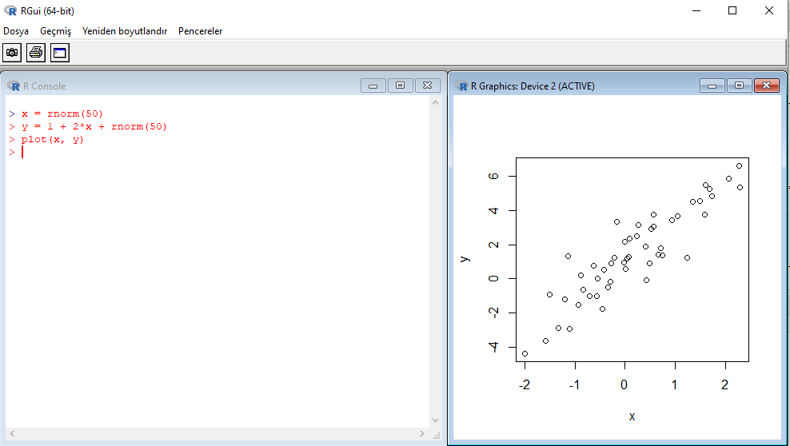

# Temel R {#temelR} 

 

- `R`, istatistiksel hesaplama, programlama ve görselleştirme için geliştirilmiş özgür bir yazılımdır. 

- `R`, veri manipülasyonu, hesaplama ve grafiksel gösterim için entegre bir yazılım paketidir. İçerisinde şunları barındırır:
  - Etkili veri işleme ve depolama olanakları.
  - Matris ve dizi hesaplamaları için çeşitli hesaplama araçları.
  - Veri analizi için büyük, tutarlı, entegre bir araç koleksiyonu.
  - Veri analizi ve gösterimi için ekran üzerinde veya çıktı alınan ortamda grafik araçları.
  - Koşullu ifadelere, döngülere, kullanıcı tanımlı özyinelemeli fonksiyonlara ve giriş/çıkış olanaklarına sahip, iyi geliştirilmiş, basit ve etkili bir programlama dili. (Kaynak: [https://www.r-project.org/about.html](https://www.r-project.org/about.html))

- Açık kaynaklı bir yazılım olan `R` dünya çapında geniş kullanıcı ağıyla sürekli geliştirilmektedir. 

- `R` Foundation'a göre `R`'ı bir istatistik sistemi olarak düşünmek yerine onu istatistiksel tekniklerin uygulandığı bir ortam olarak düşünmek daha doğrudur. `R`, paketler aracılığıyla kolayca genişletilebilir. R dağıtımı ile birlikte sağlanan temel paketler ve çok daha fazlası, modern istatistik alanını kapsayan CRAN ailesi tarafından sunulan İnternet siteleri aracılığıyla erişilebilir. Detaylar için bkz. [https://www.r-project.org/about.html](https://www.r-project.org/about.html) 

## Kurulum {#R-kurulum} 

`R` ve `RStudio` bilgisayarınızda yüklü değilse aşağıdaki adımları takip ederek yükleyebilirsiniz: 
 

1. Önce [The Comprehensive R Archive Network](https://cran.r-project.org/) adresinden `R`'ın sisteminize uygun en son versiyonunu indirerek kurunuz. 

  

Bu aşamada temel `R` fonksiyonlarını kullanmaya başlayabilirsiniz. Örneğin, 



Ancak standart `R` arayüzü ile kod yazmak, proje hazırlamak ve yönetmek kolay değildir. Bu işleri kolaylaştırmak için yaygın olarak kullanılan bir arayüz  `RStudio` programıdır. 
 

2. [RStudio](https://rstudio.com/) sitesine giderek sisteminize  uygun programı kurunuz. 


<br/>
Her iki program da özgür (free) programdır. `RStudio` sadece bir arayüzden daha fazlasını sunmaktadır.  

`RStudio` ile bir `R script` dosyası oluşturarak yazdığınız kodları kaydedebilir ve daha sonra kullanabilirsiniz. Bunun için şu adımları takip ediniz:  `File > New File > R script`. New file altında çok sayıda dosya biçimi dikkatinizi çekmiştir. Örneğin bu metin `R Markdown` dosya biçimi ile oluşturulmuştur.   


## R Komut Satırı (Console)  {#R-console} 

- Alt solda yer alan pencere `R Console` penceresidir. Burada doğrudan komutlarınızı çalıştırabilirsiniz. 

- Kısa komutlar için pratik olsa da ciddi analizler için bir _R Script_ dosyası tutmanız daha sağlıklı olacaktır.    

- Komut satırında aritmetik işlemler 
```{r}
2 + 2
```

- R'da yerleşik sabitler, $pi, e$, Inf, NA, NaN
```{r}
pi
```


```{r}
log(exp(-5))
```
```{r}
e <- exp(1)
print(e, digits = 3)
```

- Atama işlemi `=` ya da `<-` ile yapılabilir: 
```{r}
e <- exp(1)
print(e, digits = 17)
```

- Basit bir aritmetik işlem: 
$$a = (9\times 8.1) + 8.1$$ 
Sonuç: $10\times 8.1 = 81$. Komut satırında hesaplayalım:
```{r}
a <- 9*8.1 + 8.1
print(a)
```

- Daha yakından bakalım:  
```{r}
print(a, digits = 17)
```

- İkili sistem temsilindeki hata: 
```{r}
print(81-a, digits = 17)
```
Hata = $1.4210854715202004\times 10^{-14}$,  ya da 
```{r}
format(81-a, scientific = FALSE)
```

- Bu, yaptığınız hesaplamanın amacına bağlı olarak sorun yaratabilir. Örneğin yazdığınız programda bir aritmetik işlemin sonucunu başka bir sonuçla karşılaştırmak istediğinizi düşünelim. 

- Bunun için mantıksal işlemcileri kullanabilirsiniz. Örneğin
```{r}
81 == a
```

Bildiğimiz tam sonuç (81) ile aritmetik işlemin sonucu (a) eşit değil. Aslında eşit olduklarını biliyoruz. Ancak bilgisayar temsilinde (floating point arithmetic) yaklaşık olarak eşittirler:  
```{r}
all.equal(81,a)
```

Burada _default_ tolerans düzeyi $0.000000015$ kullanıldı. Yani aritmetik çözüm ile tam sonuç arasındaki fark tolerans düzeyinden küçüktür. 

- `R`'da makine hassasiyeti ($\epsilon$) 
```{r}
print(.Machine$double.eps, digits=22)
```

**Alıştırma:** Bilgisayarda temsil edilebilen 1'den küçük olan en büyük sayıyı bulunuz. 
```{r, echo=FALSE, eval=FALSE}
eps <- .Machine$double.eps
u <- 1-eps
print(u, digits=22) 
u<1
```


- Diğer aritmetik işlemler de sorun yaratabilir. Örneğin 
```{r}
b <- 10.2 - 10.1
print(b, digits = 17)
```
Bu tam sonuç $0.10$ ile aynı değildir. 

**Alıştırma** 81 sayısının ikili sistemde gösteriminin $(1010001)$ olduğunu, yani, $(81)_{10} = (1010001)_2$ olduğunu gösteriniz. Ayrıca $0.10$'in ikili gösterimini bulunuz. 


## `R`'da Nesneler {#R-nesne}  

- `R` nesneler (objects) üzerinden çalışır. Büyük-küçük harf ayırımı yapar, yani `x` ve `X` farklı nesnelerdir. Bir nesnenin içeriği `=` ya da  `<-` ile belirlenebilir. Örneğin:
```{r}
x <- 5 
y <- 2 
z <- x^y 
z 
```

- Hafızadaki tüm nesneleri görmek için 
```{r}
ls()
# ya da objects()
```
`RStudio`'da sağ üst pencerede `Environment` altında tüm nesneler görülebilir. 

- `rm(x)` komutu `x` nesnesini hafızadan siler. Tüm nesneleri silmek istersek
```{r, eval = FALSE}
rm(list=ls())
ls()
```

- Nesne isimleri rakamla başlayamaz, virgül ve boşluk içeremez (nokta içerebilir).

- Komut satırında aşagıdaki işlemleri yapınız: 
```{r eval=FALSE, include=TRUE}
2nesne <- c(10, 20)
```
```{r}
nesne2 <- c(10, 20)
nesne2
```

- Nesnelerin isimlendirilmesinde yaygın kullanılan örnekler: 
```{r}
# Örnek 1
yeni_bir_nesne <- nesne2*5
yeni_bir_nesne
```

```{r}
# Örnek 2
YeniBirNesne <- nesne2*5
YeniBirNesne
```

```{r}
# Örnek 3
yeni.bir.nesne <- nesne2^3
yeni.bir.nesne
```
 

- Temel nesne türleri
  - Vektör: nümerik, karakter, mantıksal, tamsayı
  - Matris
  - Liste
  - Veri çerçevesi (data frame)

```{r}
class(yeni_bir_nesne)
```
```{r}
typeof(yeni_bir_nesne)
```


## Vektörler {#R-vektor} 

- Bir `R` vektörü (ya da bir atomik vektör) bir değer ya da bilgi topluluğudur.

- Sayısal ya da sayısal olmayan elemanlar içerebilir. Ancak sadece bir türde değer içerebilir: reel sayılar (doubles), tamsayılar (integers), karakterler (characters), mantıksal (logicals) ve kompleks sayılar. 

- 5 öğeli sıfırlar vektörü: 
```{r}
sifirlar <- numeric(5)
sifirlar 
```

- Tüm öğeleri yanlış olan mantıksal vektör: 
```{r}
mantiksal <- logical(5)
mantiksal
```
`R`'da TRUE ve FALSE yerleşik isimlerdir, kullanıcılar tarafından değiştirilemez. 

- Boş karakter vektörü: 
```{r}
kar <- character(5)
kar
```

- Bir `R` vektörü çeşitli biçimlerde oluşturulabilir. Örneğin, aşağıdaki örnekte olduğu gibi `c()` fonksiyonuyla `a` ve `b` vektörlerini oluşturabiliriz:  
```{r}
a <- c(1,2,3,4,5)
a
```


```{r}
b <- c(1,1,1,1,1)
a+b
```

- Vektör öğelerine isim verilebilir: 
```{r}
puanlar <- c("Ahmet" = 80, "Burcu" = 95, "Hasan" = 67)
print(puanlar)
```
```{r}
names(puanlar)
```

- Tamsayı vektörü
```{r}
tam <- c(10L, 20L)
typeof(a)
typeof(tam)
```

- Karakter vektörü
```{r}
karakter <- c("iyi", "orta", "kötü")
karakter
typeof(karakter)
```


- Örnek: `skor` vektörü bir ürün için 100 üzerinden değerlendirmeleri göstersin:
```{r}
skor <- c("Denek 1" = 80, "Denek 2" = 65, "Denek 3" = 78, "Denek 4" = 94, "Denek 5" = 100, "Denek 6" = NA, "Denek 7" = 55, "Denek 8" = 85, "Denek 9" = 88, "Denek 10" = 75)
print(skor)
```


- Yaygın kullanılan vektör fonksiyonları:

```{r, eval=TRUE}
# vektörün eleman sayısı 
length(a) # ya da NROW(a)
# sırala
sort(skor) # default: küçükten büyüğe, NA hariç
# maximum 
max(a)
# minimum
min(a)
# elemanların toplamı
sum(a)
# elemanların çarpımı
prod(a) 
# Tüm elemanları a olan n-vektör: rep(a, n)
rep(1,10)
# seq(T): 1'den  T'ye tamsayı dizisi
seq(10)
# seq(t,T) t'den T'ye tamsayı dizisi
seq(5,10)
# seq(t,T,s) t'den T'ye s artışla tamsayı dizisi
seq(1,10,2)
```

- Bir vektörün elemanlarına ulaşmak için `[ ]` ile pozisyonu bildirmemiz gerekir: 
```{r}
# 1nci eleman
skor[1]
# ilk 3 eleman
skor[1:3]
# son eleman
n <- length(skor)
skor[n]
# son 3 eleman
skor[(n-3):n]
```

**Alıştırma** `skor[(n-3):n]` yerine  `skor[n-3:n]` kullanınız. Sonucu tartışınız. 
```{r}
skor[n-3:n]
```

## Mantıksal vektörler {#R-log-vek} 

- Yukarıda belirttiğimiz gibi, `TRUE` ve `FALSE` rezerve kelimelerdir. 
```{r}
# mantıksal işlemler, ==, !=, >, <, >=, <=
0 == 0
0 == 1
```

```{r}
print(a)
# 2'den büyük sayılar
a >= 3
```


- Arka planda bu kelimelerin karşılığı nümerik olarak  `TRUE` (T) için 1 `FALSE` (F) için 0'dır.  Örneğin, 
```{r} 
logic1 <- c(TRUE, FALSE, TRUE)
as.numeric(logic1) 
```


- Mantıksal vektörlerle aritmetik işlem yapılırken dikkat edilmeli.
```{r}
# parantez içinde mantıksal karşılaştırma: 
1-(a<=3)
```


- Mantıksal işlemciler, `==`, `>`, `<`, `>=`, `<=` ,`!=`, kullanarak yeni vektörler oluşturabiliriz. Örneğin,  
```{r} 
dusuk_skorlar <- (skor < 70)
dusuk_skorlar
```

- Değerlendirme notu 70'den küçük olanları bulmak istersek mantıksal ifadeleri vektör elemanlarına ulaşmakta kullanabiliriz (_logical subscripting_). Yukarıda oluşturduğumuz mantıksal vektörden hareketle: 
```{r}  
skor
skor[dusuk_skorlar]
```


 
- **Alıştırma** `skor` vektöründe kayıp değerleri `NA` bulunuz ve yeni bir vektör yaratarak bu değerleri siliniz. 

- **Çözüm** Bunun en basit yolu temel `R`'da yer alan `which()` ve `is.na()` fonksiyonlarını kullanmaktır. `is.na()` fonksiyonu `NA` elemanlar için mantıksal değer `TRUE` olmayanlar için `FALSE` değerini içeren bir mantıksal vektör oluşturur.  
```{r}
# öğe NA mı ?
is.na(skor)
```

`which()` ise `NA` olan elemanların pozisyonunu (indeks bilgisini) verir.
```{r}
# NA'nın konumunu bul
which(is.na(skor))
```

Ya da `NA` olmayan elemanların indeks bilgisini oluşturmak istersek:  
```{r}
# sayısal öğelerin konumu
which(!is.na(skor))
```

Burada `!is.na()` kayıp olmayan elemanları seçer (`!` olumsuzlama operatörüdür). Şimdi `NA` olan elemanı dışlayıp yeni bir vektör içinde kaydedelim: 
```{r}
skor2 <- skor[which(!is.na(skor))]
skor2
```

Aslında `which()` bu örnekte gereksizdir (ara adımları istemiyorsak): 
```{r}
skor2 <- skor[!is.na(skor)]
skor2
```


Kayıp gözlemleri silmek için tasarlanmış olan `na.omit()` fonksiyonu da kullanılabilir.


## Matrisler {#R-matris} 

- `R`'da matris oluşturmanın en kolay yolu `matrix()` fonksiyonudur. Örneğin, `skor` vektöründen hareketle $10\times 1$ matris oluşturalım:  
```{r}
A <- matrix(data = skor, nrow=10, ncol=1, byrow = FALSE, dimnames = NULL)
print(A)
dim(A) # matrisin boyutları satır x sütun
```
- İstersek satır ve sütunları isimlendirebiliriz: 
```{r}
rownames(A) <- names(skor)
colnames(A) <- "skor"
print(A)
```

- Matrisin boyutlarını değiştirebiliriz: 
```{r}
B <- matrix(data=1:10, nrow=5, ncol=2, byrow=FALSE, dimnames=NULL)
print(B)
```

```{r}
BB <- matrix(data=1:10, nrow=5, ncol=2, byrow=TRUE, dimnames=NULL)
print(BB)
```

- `t()` fonksiyonu ile matrisin devriği (transpose) bulunabilir: 
```{r}
t(B)
```

- Matrislerle mantıksal işlemler yapılabilir:  
```{r}
B > 5
which(B>5)
BB > 5
which(BB>5)
```
Pozisyonun sütun bazında belirlendiğine (yani matris sütun bazında vektörize edilse) dikkat ediniz.  

- Boş (sıfırlar) matrisi
```{r}
zeros <- matrix(data = 0, nrow = 5, ncol = 5)
zeros
```

- Matris oluşturmanın başka bir yolu da mevcut vektörlerin birleştirilmesidir. Bunun için `cbind` ve `rbind` kullanılabilir. Örneğin,
```{r}
x <- cbind(b,a)
x
#  
cbind(1,1:5)
```

- Bireylerin cinsiyetini içeren bir karakter vektörü oluşturalım: 
```{r}
cinsiyet <- c("Kadın", "Erkek", "Kadın", "Kadın", "Erkek", "Kadın", "Erkek", "Erkek", "Kadın", "Kadın")
print(cinsiyet) 
table(cinsiyet)
```

- Burada `cinsiyet` bir kategorik (ya da kesikli) değişkendir. Şimdi skor ve cinsiyet bilgisini bir araya getirelim ve buna `x` ismini verelim: 
```{r}
x<- cbind(skor, cinsiyet)
x
```

- Yukarıda `x`'in tüm elemanları karakter tipine zorlandı. Bunun nedeni R'da vektör ve matrislerin sadece tek tip (sayısal, karakter, mantıksal, vs.) değere sahip olabilmesidir.


## Listeler {#R-liste}  

- Bir `R` listesi farklı türlerde, uzunluk ve boyutlarda nesneleri içerebilen bir nesneler topluluğudur.   
```{r}
# bir R listesi oluştur
liste1 <- list(numaralar = seq(10,20,3), 
               isimler = c("Ahmet", "Burcu", "Hasan"), 
               birim_mat = diag(4)
               )
#  
liste1 
```

- Liste içindeki nesnelerin isimleri için `names()` komutu kullanılabilir: 
```{r}
names(liste1)
```

- Bir listenin belirli bir bileşenine `liste_ismi$bilesen_ismi` ile ulaşılabilir.
```{r}
# örnek
liste1$numaralar
liste1$numaralar[1]
```

```{r}
dim(liste1$birim_mat)
```

## Veri Çerçeveleri (Data Frames) {#R-data-fr} 


- `R`'da en temel nesnelerden biri veri çerçevesi (data frame)'dir. Belirli özelliklere sahip bir liste olarak düşünülebilir.  

- Aynı uzunlukta ve farklı tipte vektörleri bir araya getirmemize olanak tanır. Örneğin
```{r}
veri1 <- data.frame(skor, cinsiyet)
veri1
```


```{r}
names(veri1)
str(veri1)
summary(veri1)
```
```{r}
# örnek veri seti simülasyonu
set.seed(123)
x1 = rnorm(100, mean=5, sd=1.2)
x2 = rnorm(100, mean=0, sd=0.8)
grup = sample(c("A", "B", "C"), 100, replace = TRUE)
y = 2 + 2*x1 - 3*x2 + 5*(grup=="B") + 8*(grup=="C") + rnorm(100) 
#
veri2 <- data.frame(y, x1, x2, grup) # veri çerçevesini oluştur
head(veri2)
```


## Görselleştirme {#R-gorsel}

### Plot fonksiyonu 

- `plot(x, y)` iki nümerik vektör girdisini kullanarak serpilme çizimini oluşturur. örnek: 
```{r}
plot(veri2$x1, veri2$y)
```

```{r}
plot(veri2$x2, veri2$y)
```


### Eğri çizimi

Temel R'da bunun için `curve()` kullanılabilir. Yardım dosyasına ulaşmak için `?curve`.  

Örnekler: 
```{r}
# a linear function
curve(1+2*x, from=-2, to=2, xlab="x", ylab="" )
# add a quadratic function
curve(1+2*x-2*x^2, add = TRUE, col = "red" )
# cubic
curve(1+2*x-2*x^2+3*x^3, add = TRUE, col = "blue" )

```

Kendi cebirsel fonksiyonlarımızı `function()` ile oluşturup  `curve()` ya da `plot()` yardımıyla çizebiliriz:  
```{r}
# fonksiyonu tanımla
fun1 <- function(x) 2*sin(x)+cos(x)
# eğriyi çiz
curve(fun1, -pi, pi, n = 100) 
```
```{r}
# focus on the interval -2 < x < 2
plot(fun1, -2, 2)
```


### Histogram  

- Sürekli değerler alan bir nümerik vektörün histogramı için `hist()` fonksiyonu kullanılabilir: 

```{r}  
hist(veri2$x1) 
```
 
 

- Düzleştirilmiş histogram:  
```{r}
hist(veri2$x1, freq = FALSE, ylim = c(0, 0.4), xlim = c(0,10), 
     xlab = "x1", main = "Histogram")
lines(density(veri2$x1))
```

- Temel R grafiklerine bir çok alternatif mevcuttur. Bunlardan en önemlisi `ggplot2` paketidir. Bu paketin özelliklerini daha sonra inceleyeceğiz. 


### Kutu çizimi 

- Kutu çizimi için `boxplot()` fonksiyonu kullanılabilir: 
```{r} 
boxplot(veri2$x1, horizontal=TRUE)
```


- Tukey'nin 5-sayı özeti ile birlikte yorumlanmalıdır:  
```{r} 
# min Q1 median Q3 max
fivenum(veri2$x1)
summary(veri2$x1)
```

- Kategorik değişkene göre kutu çizimleri: 
```{r}  
boxplot(veri2$y ~ veri2$grup, horizontal=FALSE)
```

- Başka bir yol: 
```{r}
plot(as.factor(veri2$grup), veri2$y)
```


### Örneklem birikimli yoğunluk fonksiyonu

- ECDF (empirical cumulative density function) belirli bir değerden daha küçük gözlemlerin oranını verir. 

- Bunun grafiğini çizmek için `plot(ecdf())` kullanılabilir. Örneğin,  
```{r}
plot(ecdf(veri2$x1))
```
 
### Serpilme çizimi  

- Örnek: 
```{r} 
plot(veri2$x2, veri2$y, 
     col = rgb(0,100,0,50, maxColorValue = 255), # renk kontrolü
     pch = 16,                                   # nokta şekli
     main ="Serpilme çizimi",                    # başlık
     xlab = "x1", 
     ylab = "y"
     )
```

Detaylar için bkz. `?par`, `?points`, `?rgb`. 


### Kategorik değişkenler

Kategorik değişkenlerin frekans dağılımlarının oluşturulmasında `table()` ve `prop.table(table())` fonksiyonları kullanılabilir: 
```{r}  
table(veri2$grup)
prop.table(table(veri2$grup))
```
- `R`'da kategorik değişkenlere verilen bir başka isim faktör değişkenleridir. Bunları aşağıdaki gibi tanımlayabiliriz: 
```{r}
## etiketleri oluştur
grup_etiket <- c("A", "B", "C") 
# faktor değişkeni oluştur
grup_faktor <- factor(veri2$grup, labels = grup_etiket) 
```


```{r}
# sıklık dağılımı
table(grup_faktor)
``` 

- Çubuk çizimi (bar plot) 
```{r} 
barplot(table(grup_faktor))
```

- Pasta grafiği 
```{r}
# 
pie(table(grup_faktor), col = blues9)
```


## Temel Programlama {#R-prog}

### Mantıksal işlemler 

- Ve işlemcisi: `&`
```{r}
# doğru ve doğru = doğru
TRUE & TRUE 
```
```{r}
# doğru ve yanlış = yanlış
TRUE & FALSE 
```

```{r}
# yanlış ve doğru = yanlış
FALSE & TRUE 
```

```{r}
# yanlış ve yanlış = yanlış
FALSE & FALSE 
```
```{r}
x <- c(4, 8)
x > 3 & x < 6
```


- Veya işlemcisi: `|`
```{r}
# doğru veya doğru = doğru 
TRUE | TRUE
```

```{r}
# doğru veya yanlış = doğru 
TRUE | FALSE
```
```{r}
# yanlış veya doğru = doğru 
FALSE | TRUE
```

```{r}
# yanlış veya yanlış = yanlış
FALSE | FALSE
```
```{r}
x <- c(4, 8)
x > 3 | x < 6
```
- `!(X & Y)` ile `!X | !Y` aynı sonucu verir. 

- `!(X | Y)` ile `!X & !Y` aynı sonucu verir. 

- Mantıksal işlemleri kullanarak bir veri çerçevesinin satırları (gözlemler) seçilebilir: 
```{r}
# grup = A olanları seç
veri2_A <- veri2[grup == "A", ]
head(veri2_A)
```
```{r}
# subset() fonksiyonu ile 
head(subset(veri2, grup=="A"))
```

```{r}
# grup = A ve grup = B olanları seç
veri2_AB <- veri2[grup == "A" | grup == "B", ]
head(veri2_AB)
```
```{r}
# %in% işlemcisi ile
# grup = A ve grup = B olanları seç
veri2_AB <- veri2[grup %in% c("A", "B"), ]
head(veri2_AB)
```

- Veri çerçevesinden rassal olarak bazı gözlemlerin seçilmesi: 
```{r}
# veri2'den 10 satırın rassal seçimi
set.seed(99)
orneklem1 <- sample(1:nrow(veri2), 10, replace = FALSE)
orneklem1 # satır numaraları
```

```{r}
# veri2'den satırları çek
veri2[orneklem1, ]
```

- Benzer şekilde bir veri setinden bootstrap örneklemleri oluşturulabilir: 
```{r}
satirno <- sample(1:nrow(veri2), nrow(veri2), replace = TRUE)
boot1 <- veri2[satirno, ]
head(boot1)
```

### Koşullu işlem

- Koşullu işlemleri `if` `else` komutlarını kullanarak yapabiliriz. Kullanım örneği: 
```{r, eval=FALSE}
if (condition) {
  ....
} else {
    ....
  }
```

- Nümerik örnek:  
```{r}
a <- seq(1,10,1)
b <- 85
c <- "YTU"
if (typeof(b)=="double" |  typeof(b)=="integer") {
  print(b) } else {
    print("This is not a numeric object")
  }

```

```{r}
x <- -10
if (x < 0) {
    print("x negatif bir sayıdır") 
  } else if (x == 0) {
    print("x sıfıra eşittir") 
  } else {
    print("x pozitif bir sayıdır")
  }
```

### Döngüler
- Döngü içinde işlem yapmak için `for` komutunu kullanabiliriz. Kullanım şablonu: 
```{r, eval=FALSE}
for (dongu_degiskeni in vektor) { 
  }
``` 

Burada `dongu_degiskeni` sırasıyla `vektor` içindeki değerleri almaktadır. Örneğin, 
```{r, eval=FALSE}
for (i in 1:5) { 
  print(i) 
  }
``` 

- Nümerik örnek: 
```{r}
for (i in 1:10){
  if (i<5) {print(i^2)}
  else {print(sqrt(i))}
}
``` 

- Döngüler üç şekilde oluşturulabilir: 
  - öğeler üzerinde: `for (x in A)`
  - nümerik konum üzerinde: `for (i in seq_along(A))`
  - isimler üzerinde: `for (nm in names(A))`

- Döngüleri hızlandırmanın bir yolu nümerik indisler üzerinde döngüyü çalıştırmak ve ve döngüden önce çıktı için boş bir nesne oluşturmaktır: 
```{r, eval = FALSE}
sonuc <- numeric(length(A))
for (i in seq_along(A)) {
  sonuc[i] <- sqrt(A[i])
  }
```


### Fonksiyonel İşlemler 

- `lapply()` bir liste ya da vektörün tüm elemanlarına bir fonksiyonu uygular ve aynı uzunlukta bir çıktı içinde saklar. Böylece işlemleri döngü içinde yapmaya gerek kalmayabilir. 

- Örnek: `mtcars` veri setindeki değişkenlerin aritmetik ortalamalarını bulunuz. Bir data frame aynı zamanda bir liste olduğundan `lapply()` kullanılabilir:  
```{r}
liste_ort <- lapply(mtcars, mean)  # 
unlist(liste_ort)
```

- `lapply()` içinde kendi yazdığımız fonksiyonları da kullanabiliriz. 

- Örnek: bir veri çerçevesinin sütunlarındaki kayıp gözlemleri (NA) sayınız. Veri setimiz aşağıdaki gibi olsun: 
```{r}
set.seed(456)
x1 <- runif(100)
x2 <- runif(100)
x3 <- rnorm(100)
x4 <- rnorm(100)
napoz1 <- sample(1:100, sample(1:10, 1), replace = FALSE)
napoz2 <- sample(1:100, sample(1:10, 1), replace = FALSE)
x1[napoz1] <- NA
x2[napoz2] <- NA
data <- data.frame(x1, x2, x3, x4)
head(data)
```

```{r}
na_sayisi <- function(x) {
  sum(is.na(x))
}
unlist(lapply(data, na_sayisi))
```
```{r}
# ya da daha basit olarak 
unlist(lapply(data, function(x) sum(is.na(x))))
```

- `sapply()` ve `vapply()` fonksiyonelleri `lapply()` gibi çalışır. Ancak çıktı olarak atomik vektör oluştururlar

```{r}
# data sütunları nümerik mi?
sapply(data, is.numeric)
```

```{r}
# data sütunlarında NA sayısı 
sapply(data, function(x) sum(is.na(x)))
```

```{r}
# vapply() için çıktı vektörünün türünü bildirmemiz gerekir
vapply(data, is.numeric, logical(1))
```

```{r}
# data sütunlarında NA sayısı 
vapply(data, function(x) sum(is.na(x)), numeric(1))
```

`sapply()` interaktif uygulamalarda `vapply()` ise programlamada önerilir. 

- Matris veya çok boyutlu diziler için `apply()` kullanılabilir: 
```{r}
# 200 x 5 boyutlu bir uniform matris oluştur 
set.seed(789)
X <- matrix(runif(1000), ncol = 5)
colnames(X) <- letters[1:5]
head(X)
```
```{r}
# X'in sütun ortalamalarını bul 
apply(X, 2, mean) # satırlar için margin=1, sütunlar için ise 2
```


## R Fonksiyonları {#R-fonksiyon} 

- R'da bütün işlemler fonksiyonlarla yapılır. Tipik bir R fonksiyonu girdiler (argümanlar) ve çıktılardan oluşur. 

- Örneğin `mean()` fonksiyonu `skor` girdisiyle çalıştırılırsa : 
```{r}
mean(skor)
```
Burada çıktının ortalama değil NA olması öğelerden birinin NA olmasından kaynaklanır. Kayıp gözlemleri dışlayalım: 
```{r}
mean(skor, na.rm = TRUE) # ya da mean(skor, TRUE)
```
Kullanıcı girmezse `na.rm = FALSE` değerini alır ve sonuç NA olur. 

- Örneklem standart sapması: 
```{r}
sd(skor, na.rm = TRUE)
```

Fonksiyonun girdilerini görmek için: 
```{r}
args(sd) 
```
Fonksiyonu ekrana yazdırmak için x
```{r}
sd
```


- Kendi fonksiyonlarımızı yazmak için `function()` fonksiyonunu kullanabiliriz. 
```{r, eval=FALSE}
fonksiyon_ismi <- function(girdi1, girdi2) {
  ... işlemler ...
  }
```

- **Örnek**: Bir sayının tek mi çift mi olduğunu bulan bir fonksiyon yazalım: 
```{r}
tek_cift <- function(x) {
    if (x == 0) {
      print("Girdiğiniz sayı sıfırdır!")
    } else if (x %% 2 == 0) {
      print("Çift sayı") 
    } else {
      print("Tek sayı")
    }
}
```
```{r}
# tek_cift() fonksiyonunu kullanabiliriz
tek_cift(4) 
tek_cift(5L) 
```

**Örnek**: Türkçe bir harfin alfabede kaçıncı harf olduğunu ekrana yazan bir fonksiyon yazınız. 

```{r}
kacinci_harf <- function (harf) {
  harfler <- c(letters[1:3], "Ç", letters[4:7], "ğ", letters[8], "ı", letters[9:15],
               "ö", letters[16], letters[18:19], "ş", letters[20:21], "ü", 
               letters[c(22,25,26)]) 
  HARFLER <- c(LETTERS[1:3], "Ç", LETTERS[4:7], "Ğ", LETTERS[8], "I", "İ", 
               LETTERS[10:15], "Ö", LETTERS[16], LETTERS[18:19], "Ş", 
               LETTERS[20:21], "Ü", LETTERS[c(22,25,26)]) 
  
  if (length(which(harfler == harf)) == 0) {
     paste0(harf, " alfabenin ", which(HARFLER == harf), ". harfidir")
  } else {
     paste0(harf, " alfabenin ", which(harfler == harf), ". harfidir")
  }
 
}
kacinci_harf("h")
kacinci_harf("İ")
kacinci_harf("Ş")
```


## R Paketleri {#R-paket} 

- `R` kurulumuyla gelen temel paketler: 
```{r}
rownames(installed.packages(priority="base"))
```

- `R` programının güçlü yanlarından biri kullanıcılar tarafından yazılmış paketlerin yüklenmesiyle geliştirilebilmesidir. 

- Örneğin, `{corrplot}` paketi korelasyon matrisini görselleştirir:
```{r eval=FALSE, message=FALSE, warning=FALSE, paged.print=FALSE} 
install.packages("corrplot", repos='http://cran.us.r-project.org')
```
Detaylar için bkz [https://cran.r-project.org/web/packages/corrplot/index.html](https://cran.r-project.org/web/packages/corrplot/index.html). 

- Alternatif olarak aynı işlem `RStudio` menüsünden de yapılabilir: `Tools>InstallPackages` ilgili pencerede "{corrplot}" paket ismini yazmamız gerekir. 
- Paketi kullanabilmek için önce yüklememiz daha sonra ise aktif hale getirmemiz gerekir:
```{r message=FALSE, warning=FALSE, paged.print=FALSE}
library(corrplot)
kor_matris <- cor(mtcars)
corrplot(kor_matris)
```

Komut satırında `?corrplot` yazarak yardım dosyasını inceleyebiliriz (detaylı dokümantasyon dosyaları için ` help(package = "corrplot")` komutu kullanılabilir) . Korelasyon matrisini nümerik değerleri kullanarak da görselleştirebiliriz. Yardım dosyasında da görüleceği gibi `method="number"` opsiyonu bu amaç için kullanılabilir: 
```{r}
corrplot(kor_matris, method = "number")
```

Pakete ilişkin örnekleri çalıştırmak için komut satırında aşağıdaki kodu çalıştırınız: 
```{r, eval = FALSE}
example(corrplot)
```


Pakete ilişkin diğer bilgiler için `packageDescription(" ")` komutu kullanılabilir: 
```{r}
packageDescription("corrplot")
```

Birden fazla paketi yüklemek istersek: 
```{r eval=FALSE, message=FALSE, warning=FALSE, paged.print=FALSE} 
install.packages("corrplot", "MASS")
```

`R` varsayılan paket deposu [CRAN (The Comprehensive R Archive Network)](https://cran.r-project.org/) üzerinden bu iki paketi yüklemeye çalışır. CRAN deposu en popüler yollardan biri olsa da paket yüklemenin başka yolları da vardır. Örneğin, `{devtools}` paketi ile [github](https://github.com/) üzerinden ya da yerel olarak paketler yüklenebilir. 


## Çalışma dizini {#R-dizin} 

`getwd()` komutu ile güncel dizini görebiliriz: 
```{r, eval=FALSE}
getwd()
```

Bunu değiştirmek istersek `setwd("/tam/adres/")` komutunu kullanabiliriz. Dizin adresinde `\` yerine `/` kullanıldığına dikkat ediniz: 
```{r, eval=FALSE, echo=TRUE}
setwd("C:/Users/Folder/Another-Folder/R-uygulama-1")
```

Tipik olarak bu R dosyaları başka bilgisayarlarda çalışmaz. Her bilgisayarda bu adreslerin tekrar tanımlanması gerekebilir. Bu da hatalara davetiye çıkarır. 

RStudio'da **R proje** klasörü oluşturarak çalışma dizininin otomatik olarak algılanmasını sağlayabiliriz. Bir R projesi yardımıyla dosyaların başka bilgisayarlarda da çalışması mümkün olur. 

## R ile Online Veri İndirme 

- `R` ile World Bank WDI, Eurostat, IMF vb. platformlardan çevrimiçi veri indirmek için çeşitli paketler geliştirilmiştir.

- Çevrimiçi veri indirme paketlerinin bir listesi ve kullanım örnekleri için bkz. 

[https://github.com/htastan/R-veri-indirme](https://github.com/htastan/R-veri-indirme)


