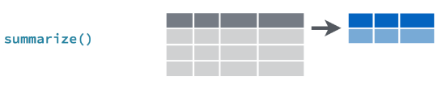

# R Tidyverse {#tidyRgiris}


- [Tidyverse](https://www.tidyverse.org/) modern veri analizi için geliştirilmiş `R` paketler topluluğuna verilen isimdir. 

- Bu konuda temel kaynak Garret Grolemund ve Hadley Wickham tarafından yazılan [R for Data Science](https://r4ds.had.co.nz/) kitabıdır. 

- Bu kitabın birinci baskısının Türkçe çevirisi için bkz. 
[https://tr.r4ds.hadley.nz/](https://tr.r4ds.hadley.nz/)

- Ayrıca diğer kaynaklar için bkz. [*Tidy Data*](https://vita.had.co.nz/papers/tidy-data.pdf) (Hadley Wickham, 2014 JSS), ve [Tidy data Vignette](https://cran.r-project.org/web/packages/tidyr/vignettes/tidy-data.html)  


```{r, echo=TRUE, warning=FALSE}
library(tidyverse)
```

- `library(tidyverse)` komutu ile aşağıdaki R paketlerinin tamamı aktif hale gelir: 
  * `{ggplot2}`: verilerin görselleştirilmesi
  
  * `{dplyr}`: verilerin işlenmesi
  
  * `{tidyr}`: verilerin düzenli ("tidy") hale getirilmesi
  
  * `{readr}`: verilerin okunması
  
  * `{purrr}`: fonksiyonel programlama
  
  * `{tibble}`: veri çerçevesi (data.frame'in yeni yorumu)
  
  * `{stringr}`: karakterlerin işlenmesi
  
  * `{forcats}`: faktör değişkenlerinin işlenmesi 
  
Bu paketlerin yanı sıra Tidyverse yaklaşımıyla uyumla çok sayıda R paketi mevcuttur. 

## R "Tidy" veri çerçeveleri 

- Bir düzenli (tidy) veri seti standart dikdörtgensel yapıya sahiptir. Ancak sütunlar değişkenleri, satırlar ise gözlemleri göstermelidir. Her veri seti düzenli formatta olmayabilir. Veri analizinden önce düzenli hale getirilmesi gerekebilir. 

![Düzenli (tidy) bir veri setinin yapısı (kaynak: [R for Data Science]<https://r4ds.had.co.nz/tidy-data.html>)](img/tidy.png) 


Örnek olarak aşağıdaki veri setini düşünelim: 
```{r, warning=FALSE}
library(gapminder)
head(gapminder)
```

`gapminder` Tidyverse jargonunda bir **tibble**'dır. Tibble (ya da `tbl_df`) R veri çerçevesinin daha modern bir yorumu olarak düşünülebilir (detaylar için bkz [https://tibble.tidyverse.org/](https://tibble.tidyverse.org/)). 

`{tibble}` paketindeki `tibble::tibble()` fonksiyonunu kullanarak bir tidy veri seti yaratabiliriz: 
```{r, echo=TRUE, results="hold"}
tibble(
  x = 1:5, 
  y = 1, 
  z = x ^ 2 + y
)
```

Başka bir örnek:  
```{r}
df <- tibble(
  xvariable = runif(5),
  depvariable = 2+ 5*xvariable + rnorm(5)
)
df
```

Tıpkı temel R'daki `data.frame` fonksiyonunda olduğu gibi `tibble` içindeki değişkenlere çeşitli yollarla ulaşabiliriz:  
```{r}
# extract by column name
df$xvariable
```
```{r}
# extract by column name
df[["xvariable"]]
```
```{r}
# extract by column position
df[[1]]
```
 

## `{readr}` Paketi ile Verilerin okutulması 

- Tidyverse meta-paketindeki [`{readr}`](https://readr.tidyverse.org/) paketi verilerin okutulmasına ilişkin çeşitli fonksionlar içerir. 

- `read_` ile başlayan bu fonksiyonlar şunlardır: 
  - `read_csv()`: virgülle ayrılmış dosya (comma separated (CSV)) 
  - `read_tsv()`: tab ile ayrılmış  
  - `read_delim()`: ayrılmış (örneğin ";" ya d "|" ile ayrılmış)
  - `read_fwf()`: sabit genişlikli dosya
  - `read_table()`: sütunların boşluklarla ayrıldığı tablo şeklindeki dosyalar 
  - `read_log()`: web log dosyaları
  
- Örnek: `veriler/trveri1.csv` her ne kadar uzantısı csv olsa da sütunların noktalı virgülle ayrıldığı bir dosya. Bu nedenle `read_delim()` kullanılabilir. 
```{r}
tr_veri <- read_delim("veriler/trveri1.csv", delim = ";")
```

Fonksiyonun çıktısında hangi değişkenlerin karakter hangilerinin nümerik (double) olarak okunduğunu görebiliyoruz. 

```{r}
tr_veri
```

- Aynı veri setinin tab ile ayrılmış text dosyası formu: 
```{r, warning=FALSE}
tr_veri <- read_tsv("veriler/trveri1.txt")
tr_veri
```


- Bu veri seti düzenli bir yapıda değildir. Satırlarda değişkenler, sütunlarda ise yıllar yer almaktadır. Verileri `{tidyr}` paketindeki fonksiyonları kullanarak yeniden düzenleyebiliriz. Bunu daha sonra göreceğiz. 

- Dosyada yer alan değişkenlerin türlerini de belirtmek mümkündür. Kullanım rehberindeki örneğe bakalım: 
```{r}
mtcars <- read_csv(readr_example("mtcars.csv"), col_types = 
  cols(
    mpg = col_double(),
    cyl = col_integer(),
    disp = col_double(),
    hp = col_integer(),
    drat = col_double(),
    vs = col_integer(),
    wt = col_double(),
    qsec = col_double(),
    am = col_integer(),
    gear = col_integer(),
    carb = col_integer()
  )
)
```

```{r}
str(mtcars)
```

- Excel dosyalarının okutulmasında [`{readxl}`](https://readxl.tidyverse.org/) paketi kullanılabilir. Bunun için paketin ayrıca yüklenmesi gerekir. Örnek: 

```{r}
library(readxl)
tr_veri <- read_xlsx("veriler/trveri1.xlsx")
tr_veri
```

- Stata, SPSS, ve SAS veri dosyalarının da okutulması mümkündür. Bunun için [`{haven}`](https://haven.tidyverse.org/) paketinin yüklenmesi gerekir. Interaktif veri yüklemek için bkz. Environment -> Import Dataset -> From Stata, etc. 


## `{tidyr}` Paketi ile Verilerin Düzenlenmesi

- veriler çok çeşitli biçimlerde karşımıza çıkabilir. Bir örneğini yukarıda görmüştük. 

- Veri düzenlemesine ilişkin çeşitli örnekler: 

```{r}
# düzenli bir veri seti
table1
```

```{r}
# satırlarda değişkenler var, yıl aynı ülke için tekrar ediyor
table2
```

```{r}
# değişken (rate) karakter vektörü olarak tanımlı
# ayrıca iki rakamın oranı açıkça yazılmış
table3
```


```{r}
# sütunlarda değişkenin (cases) yıl ölçümleri var
table4a
```
```{r}
# sütunlarda değişkenin (population) yıl ölçümleri var
table4b
```
- Bu veri setlerini nasıl tidy formata dönüştürebiliriz? Tidy formatta aşağıdaki kurallara uyulması gerekmektedir: 

1. Her değişken kendi sütununda olmalıdır.  
1. Her gözlem kendi satırında olmalıdır. 
1. Her değer kendi hücresinde olmalıdır. 

- Verilerin yeniden organize edilmesinde [`{tidyr}`](https://tidyr.tidyverse.org/) paketinde yer alan iki fonksiyon çok faydalı olabilir. 

  - `pivot_longer()`: verileri yeniden düzenleyerek uzun forma dönüştürür
  
  - `pivot_wider()`: verileri yeniden düzenleyerek geniş forma dönüştürür. 
  
- Örnek: `table4a` ve `table4b` verilerini uzun forma dönüştürelim: 

```{r}
pivot_longer(table4a, cols = 2:3, names_to = "year", values_to = "cases")
```

```{r}
pivot_longer(table4b, cols = 2:3, names_to = "year", values_to = "population")
```


- Örnek: `table2` verilerini geniş forma dönüştürelim: 
```{r}
pivot_wider(table2, names_from = "type", values_from = "count")
```

- Örnek: `tr_veri` verisini düzenli hale getirelim: 
```{r}
tr_veri
```
```{r}
pivot_longer(tr_veri, 
             cols = c(`y2005`, `y2010`, `y2015`), 
             names_to = "yil", 
             values_to = "olcum")
```

Bu veri setinde satırlarda değişkenler var. Ayrıca `yil` değişkeninin önünde "y" karakteri var. Bunu aşağıdaki gibi düzeltebiliriz: 
```{r}
tr_veri_uzun <- pivot_longer(tr_veri, 
                             cols = c(`y2005`, `y2010`, `y2015`), 
                             names_to = "yil", 
                             values_to = "olcum",
                             names_prefix = "y"
                             )
tr_veri_uzun
```

Şimdi `pivot_wider()` ile değişkenleri sütunlara alalım: 
```{r}
pivot_wider(tr_veri_uzun, names_from = "degisken", values_from = "olcum")
```

Birleştirilmiş bu düzenli veri setinde `il` ve `yil` çifti bir gözlemi oluşturur. İstanbul ilinde 2005 yılında sadece bir satır bulunabilir. 


### Kayıp gözlemler 

- `drop_na()`: kayıp gözlemleri sil 
```{r}
df <- tibble(x = c(1, 2, NA), 
             y = c("a", NA, "b"))
df
```


```{r}
# tüm NA gözlemleri sil
drop_na(df)
```


```{r}
# x sütunundaki NA gözlemleri sil
drop_na(df, x)
```


- `fill()`: kayıp gözlemleri bir önceki ya da bir sonraki doldur. Örnek (help dosyasından): 
```{r}
sales <- tibble::tribble(
  ~quarter, ~year, ~sales,
  "Q1",    2000,    66013,
  "Q2",      NA,    69182,
  "Q3",      NA,    53175,
  "Q4",      NA,    21001,
  "Q1",    2001,    46036,
  "Q2",      NA,    58842,
  "Q3",      NA,    44568,
  "Q4",      NA,    50197,
  "Q1",    2002,    39113,
  "Q2",      NA,    41668,
  "Q3",      NA,    30144,
  "Q4",      NA,    52897,
  "Q1",    2004,    32129,
  "Q2",      NA,    67686,
  "Q3",      NA,    31768,
  "Q4",      NA,    49094
)
sales
```

`sales` veri setinde yıl değerleri sadece değiştiğinde açıkça yazılmış. Aslında NA değil Q1 dönemindeki yıl değerine eşit. 
```{r}
# year değerlerini yukarıdan aşağıya doğru doldur
fill(sales, year)
```


- `replace_na()`: NA yerine belirtilmiş (bilinen) değerleri yaz. 
```{r}
df <- tibble(x = c(1, 2, NA), 
             y = c("a", NA, "b"))
df
```


```{r}
# x değişkeninde NA değerleri yerine 0 
# y değişkeninde NA değerleri yerine "bilinmiyor" yaz
replace_na(df, list(x = 0, y = "bilinmiyor"))
```

- `complete()`: Gizli kayıp gözlemleri açık hale getir. 
```{r}
df <- tibble(il = c("İstanbul", "İstanbul", "Ankara"), 
             yil = c(2019, 2020, 2019), 
             kfe = c(250, 300, 220))
df
```

```{r}
complete(df, il, yil)
```


### Hücrelerin ayrılması veya birleştirilmesi

- `table3` veri setinde `rate` değişkeni oran karakteri ile tanımlanmıştı: 
```{r}
table3
```

Bu haliyle analizde kullanılması mümkün değildir. 

- Bir sütunun hücrelerini ayırmak için `separate()` fonksiyonu kullanılabilir: 
```{r}
separate(table3, col = rate, sep = "/", into = c("cases", "population"))
```


- Hücreler ayrılıp satır haline de getirilebilir: 
```{r}
separate_rows(table3, rate, sep = "/")
```

- Alıştırma: Yukarıdaki veri seti "düzenli" formda mıdır? Değilse nasıl düzenli hale getirilebilir? 
Cevap: 
```{r}
table3_a <- separate_rows(table3, rate, sep = "/")
table3_a <- table3_a |> group_by(country, year) |> 
  mutate(rowno = row_number())
table3_a
table3_b <- pivot_wider(table3_a, names_from = "rowno", values_from = "rate")
table3_b 
table3_b |> rename(cases = `1`, population = `2`)
```
```{r}
# sütun isimlerinin önüne bir kelime eklenebilir: 
pivot_wider(table3_a, 
            names_from = "rowno", 
            values_from = "rate", 
            names_prefix = "variable")
```

- Bazı durumlarda hücrelerin birleştirilmesi gerekebilir. Örneğin, 
```{r}
# century ve year değişkenlerinin hücrelerini birleştirmek isteyebiliriz
table5
```

```{r}
table5a <- unite(table5, century, year, col = "year", sep = "")
table5a
```

```{r}
# rate sütununu ayır
separate(table5a, col = rate, sep = "/", into = c("cases", "population"), convert = TRUE)
```

## `{dplyr}` Paketi ile Verilerin Manipülasyonu {#dplyr}

- Verilerin işlenmesi, özetlenmesi, birleştirilmesi, yeni veriler oluşturulması ve benzeri işlemler için çeşitli fonksiyonlar içerir. 

- Temel `{dplyr}` fonksiyonları şunlardır: 
  - `filter()`: belirli mantıksal ölçütlere uygun alt kümelerin oluşturulması
  - `select()`: sütunların (değişkenlerin) seçimi 
  - `mutate()`: yeni değişken oluşturma 
  - `summarize()`: verilerin özetlenmesi
  - `arrange()`: verilerin sıralanması 
  
- Tüm işlemler, satır seçimi, sütun seçimi, yeni değişken oluşturma, özetleme, sıralama, veri içindeki grup değişken(ler)ine göre yapılabilir. Bunun için `group_by()` fonksiyonu kullanılır. 

### `filter()`: gözlemlerin filtrelenmesi 

- `dplyr::filter()` fonksiyonu ile satırlara göre alt kümeler oluşturabiliriz. 

- Belirttiğimiz kriterlere uygun gözlemlerden oluşan yeni veri çerçeveleri veya tablolar oluşturabiliriz.  


- **Örnek** `gapminder` ülke veri setinde Türkiye'nin gözlemlerini almak istediğimizi düşünelim. Veri setini incelediğimizde Türkiye'nin 1573 ile 1584 satırları arasında yer aldığını görüyoruz. Bu bilgiden hareketle Türkiye veri setini aşağıdaki gibi oluşturabiliriz: 
```{r, warning=FALSE}
library(tidyverse)
library(gapminder)
(turkey <- gapminder[1573:1584,])
```

- Satır numaralarını kullanarak verileri çekmek hata olasılığını arttırdığı için tercih edilmemelidir. 

- Bunun yerine `dplyr::filter()` fonksiyonunu kullanabiliriz. Bu fonksiyonun girdisi verilerin satırlarına uygulanan mantıksal ifadelerdir. Örneğin: 
```{r}
filter(gapminder, country == "Turkey")
```

- Bu fonksiyonun kullanımı baz `R`'daki  `subset()` fonksiyonuna benzemektedir.  

- `filter()` fonksiyonu çoklu ifadelerin kullanılmasına izin verir. Örneğin, Türkiye'nin 2000 sonrası verileri için aşağıdaki komutu kullanabiliriz: 
```{r}
filter(gapminder, country == "Turkey", year>2000)
```

- **Örnek**: Türkiye ve Brezilya'nın 2000 sonrası gözlemlerini içeren bir tablo oluştur:   
```{r}
filter(gapminder, country %in% c("Turkey","Brazil"), year>2000)
```

### `select()`: değişkenlerin seçimi  


- Sütunlardan (değişkenlerden) hareketle yeni bir tablo (tibble) oluşturmak istersek `dplyr::select()` fonksiyonunu kullanabiliriz. 

- ***Örnek** `mtcars` veri setinde `mpg`, `cyl`, `hp` değişkenlerinden oluşan bir tablo oluştur 
```{r}
mtcars
```

```{r}
# dplyr::select() can clash with MASS::select()
library(dplyr)
mtcars2 <- dplyr::select(mtcars, mpg, cyl, hp)
mtcars2
```

- `filter()` komutu ile birlikte kullanılabilir.

- **Örnek**: `gapminder` veri setinde Türkiye için sadece yıl, yaşam beklentisi ve kişi başına GDP değişkenlerinden oluşan bir veri çerçevesi oluştur: 
```{r}
gapminder |> filter(country == "Turkey") |> 
  select(year, lifeExp, gdpPercap)
```

- **(pipe) işlemcisi %>% (magrittr paketi) veya |> (R native) **: bu işlemciyi kullanarak `f(g(x))` gibi bir işlemi `x %>% g() %>% f()` şeklinde yazabiliriz. Böylece yazdığımız programlar daha basit ve anlaşılır olabilir. 

- Önceki örnekte `gapminder` veri seti önce `filter()` fonksiyonuna gönderilerek Türkiye seçildi. Sonraki ` %>% ` işlemi ile `select()` fonksiyonuna gönderildi ve sütunlar seçildi. Aynı kodu şöyle de yazabilirdik: 

```{r}
select(filter(gapminder, country == "Turkey"), year, lifeExp, gdpPercap)
```


- **Örnek**: Türkiye ve Brezilya için 2000 sonrasında kişi başına GDP değişkenini içeren bir tablo oluştur: 
```{r}
gapminder  |>  filter(country %in% c("Turkey","Brazil"), year>2000) |>  
  select(year, country, gdpPercap)
```

- **Alıştırma**: Önceki örnekteki tabloyu sadece baz R fonksiyonlarını kullanarak oluşturunuz. 

- **Çözüm**: `R`'da bir görevi yerine getirmenin birden çok yolu olabilir. Bir çözüm: 
```{r}
gapminder[gapminder$country  %in% c("Turkey", "Brazil") & gapminder$year>2000, c("year", "gdpPercap")]
```


- Eğer bir sütunu alıp atomik bir vektör oluşturmak istersek `pull()` fonksiyonunu kullanabiliriz. Örneğin, `gapminder` veri setindeki ülkelerin isimlerini içeren bir karakter vektörü uluşturalım: 
```{r}
ulkeler <- unique(pull(gapminder, country))
head(ulkeler)
```


- Sütun seçimine yardımcı olabilecek fonksiyonlar: 
  - `contains()`: bir ifadeyi içeren sütunları seçer 
  - `ends_with()`: belirli bir ifade ile biten sütunları seçer 
  - `starts_with()`: belirli bir ifadeyle başlayan sütunları seçer
  - `matches()`: bir ifadeyle eşleşen sütunları seçer  


### `mutate()`: yeni değişken oluşturma 


- `dplyr::mutate()` fonksiyonu ile veri setine yeni değişkenler (sütunlar) ekleyebiliriz. 

- `mutate()` içinde kullanılan fonksiyonlar vektörleştirilmiş olmalıdır; yani hem girdi hem de çıktı vektör olmalıdır. 

- **Örnek**: Kişi başına GDP'nin doğal logaritmasının ayrı bir değişen olarak veri setine eklenmesi:   
```{r}
mutate(gapminder, lgdppc = log(gdpPercap))  |>  
  head(5)
```

- **Örnek**: Veri setinde kişi başına GDP değerleri var ancak toplam GDP yok. Nüfus bilgisini kullanarak toplam ülke GDP değerlerini oluşturunuz. 
```{r}
mutate(gapminder, gdp = gdpPercap*pop )  |> 
  select(year, country, gdpPercap, pop, gdp) |>  
  head(5)
```

- `mutate()` ile ilişkili diğer fonksiyonlar: 
  - `transmute()`: yeni değişkenler oluşturur ve mevcut değişkenleri siler. 
  - `mutate_all()`: bir fonksiyonu tüm sütunlara uygular
  - `mutate_if()`: sadece kritere uyan sütunlara bir fonksiyonu uygular
  - `mutate_at()`: bir fonksiyonu belirtilmiş sütunlara uygular

- **Örnekler**
```{r}
df <- tibble(x = 1:5, 
             y = 20:16, 
             z = letters[1:5])
df
```

```{r}
# transmute() drops variables after mutating
df  |> transmute(w = x*y)
```

```{r}
# nümerik sütunların doğal logaritmasını ve 10 tabanına göre 
# logaritmasını al
# çoklu dönüştürmeler list() içinde belirtilmeli
df |> mutate_if(is.numeric, list(ln = log, log10 = log10))
```

```{r}
# character değişkenin varsa factor değişkenine dönüştür 
df |> mutate_if(is.character, as.factor)
```

```{r}
# sadece x ve y'nin karelerini ayrı sütun olarak ekle
df |> mutate_at(c("x", "y"), list(sq = function(x) x^2))
```

- `mutate()` içinde kullanılan fonksiyonları vektörize olması gerekir. Yani bir vektör girdisine karşılık bir vektör çıktısı hesaplanır. Bu fonksiyonlardan bazıları şunlardır: 
  - `dplyr::lag()`: bir vektörün gecikmesini alır. `stats::lag()` ile karıştırılmamalıdır. 
  - `dplyr::lead()`: bir vektörün öncü değerlerini oluşturur. 
  - kümülatif aritmetik işlemler: `cumall()`, `cumany()`, `cummax()`, `cummean()`, `cummin()`,     `cumprod()`, `cumsum()`
  - sıralamalar: `min_rank()`, `percent_rank()`, `row_number()`, `cume_dist()`
  - matematiksel işlemler: `+`, `-`, `*`, `/`, `^`, `%%`, `log`, `log10`, ...
  - mantıksal işlemler: `==`, `<`, `<=`, `>`, `>=`, `!=`, `between()`, `near()`
  - `if_else()`: koşullu işlemleri eleman bazında uygular 
  - `case_when()`: çoklu if-else 
  - `na_if()`: NA değerleri yerine belirli değerleri yaz
  


### `arrange()`: verilerin sıralanması  


- Veri setinin satırlarının (gözlemlerin) sıralanmasında  `dplyr::arrange()` fonksiyonu kullanılabilir. 

- **Örnek**: `gapminder` veri setini yıla göre sırala. 
```{r}
arrange(gapminder, year)
```
Default olarak küçükten büyüğe sıraladı. Büyükten küçüğe sıralamak istersek: 
```{r}
arrange(gapminder, desc(year))
```


- **Örnek**: Yılı artan, ülkeleri alfabetik olacak şekilde satırları yeniden düzenle: 
```{r}
arrange(gapminder, year, country) 
```

- **Örnek**: Ülkeler alfabetik, yıl artan:  
```{r}
arrange(gapminder, country, year) 
```


- `filter()` ve `arrange()` birlikte kullanılabilir. Örneğin: 
```{r}
gapminder |>  
  filter(year==2007, continent=="Americas") |> 
  arrange(lifeExp) 
```

- **Örnek**: 2007 yılında Avrupa kıtasındaki ülkelerde yaşam beklentisini büyükten küçüğe sıralayınız. 
```{r}
gapminder |>  
  filter(year==2007, continent=="Europe") |>  
  arrange(desc(lifeExp)) 
```

### `group_by()`: verilerin gruplanması 

- Verilerin gruplandırılması amacıyla kullanılır. 

- Verilerin görünümünü değiştirmez. 

- `summarize()` gibi diğer fonksiyonlarla birlikte kullanılabilir.
```{r}
gapminder |>  
  group_by(continent, year)  
```

```{r}
gapminder |>   
  group_by(continent, year) |> 
  arrange(year)
```
- `ungroup()` ile gruplar çözülebilir. 

### `summarize()`: verilerin özetlenmesi 

 


- Verilerin özet istatistiklerinin oluşturulmasında `dplyr::summarize()` kullanılabilir. 

- Bu komut öncesinde `group_by()` ile veriler gruplandırılarak grup istatistikleri oluşturulabilir. 


- **Örnek**: 2007 yılında her bir kıtada kaç ülke var?
```{r}
gapminder |>  
  filter(year==2007) |> 
  group_by(continent) |> 
  summarize(n = n())
```


- **Örnek**: 2007 yılında kıtalara göre ortalama yaşam beklentisini ve ortalama kişi başına GDP değerini bulunuz. 

```{r}
gapminder  |>  
  filter(year==2007) |>
  group_by(continent) |>
  summarize(mean_life_exp = mean(lifeExp), 
            mean_income = mean(gdpPercap))
```

- Kullanışlı diğer fonksiyonlar: 
  - `summarize_at()`: belirli değişkenlerin özet istatistiklerini hesaplar 
  - `summarize_all()`: tüm değişkenlerin özet istatistiklerini hesaplar. 
  - `summarize_if()`: sadece bir tip değişkenlerin değerlerini hesaplar. 
  
- **Örnek**: `summarize_at()` kullanımı: 
```{r}
gapminder |> 
  filter(year==2007) |>
  group_by(continent) |>
  summarize_at(vars(lifeExp, gdpPercap), mean) 
```

- **Örnek**: 
```{r}
gapminder |> 
  filter(year==2007) |>
  group_by(continent) |>
  summarize_at(vars(lifeExp, gdpPercap), list(min = min, max = max))
```

**Örnek**: Önceki işlemi 1952 ve 2007 yılları için yapalım ve ortalamaları karşılaştıralım: 
```{r}
gapminder |> 
  filter(year %in% c(1952, 2007)) |>
  group_by(continent, year) |>
  summarize_at(vars(lifeExp, gdpPercap), mean)
```

Gruplamanın iki değişken üzerinden `group_by(continent, year)` yapıldığına dikkat ediniz.

- `summarise()` ile kullanılabiliecek fonksiyonlar aşağıda listelenmiştir. Bu fonksiyonların girdiden hareketle sadece bir özet istatistik verdiğine dikkat ediniz: 
  - `n()`: satır (gözlem) sayısı
  - `n_distinct()`: farklı gözlem sayısı
  - `sum()`: toplam
  - `sum(!is.na())`: NA olmayan gözlem sayısı
  - `first()`: ilk değer 
  - `last()`: son değer
  - `nth()`: n.nci sıradaki değer 
  - `mean()`: örneklem ortalaması,  
  - `median()`: medyan, 
  - `var()`: örneklem varyansı, 
  - `sd()`: örneklem standart sapması, 
  - `mad()`: medyan mutlak hata (median absolute deviation), 
  - `IQR()`: kartiller aralığı (interquartile range), 
  - `min()`: minimum, 
  - `max()`: maksimum
  - `quantile()`: n.nci dilim 

- **Örnek**: Avrupa'da her yıl için minimum ve maksimum yaşam beklentisini bulunuz.  
```{r}
gapminder |> 
  filter(continent=="Europe") |>
  group_by(year) |>
  summarize(minlexp = min(lifeExp), 
            maxlexp = max(lifeExp) )
```

- `mutate()` ve `group_by()` fonksiyonlarının birlikte kullanılabilir: 

- **Örnek**: Her ülke için kişi başına GDP değişkeninin başlangıç yılındaki değerine oranını gösteren yeni bir değişken oluşturunuz. Yeni değişken başlangıç yılı olan 1952'de 1 değerini almalı, diğer yıllar için başlangıç yılına göre (1+büyüme oranı) olmalı.   
```{r}
gapminder |>  
  group_by(country) |>
  select(country, year, gdpPercap) |> 
  mutate(gdppc_to_first = gdpPercap/first(gdpPercap))
```


- **Örnek**: Yıldan yıla büyüme oranlarını yüzde olarak gösteren yeni bir değişken oluşturunuz.
```{r}
gapminder |>  
  group_by(country) |>
  select(country, year, gdpPercap) |> 
  mutate(gdppc_growth = 100*(gdpPercap-lag(gdpPercap))/lag(gdpPercap))
```

Örnekte kullanılan `lag()` fonksiyonu bir önceki dönemdeki (yılda) değere eşit olan birinci gecikmedir. Gecikmeyi açıkça veri setine ekleyelim: 

```{r}
gapminder |>  
  group_by(country) |>
  select(country, year, gdpPercap) |> 
  mutate(lag_gdppc = lag(gdpPercap, 1, order_by = year), 
         gdppc_growth = 100*(gdpPercap-lag_gdppc)/lag_gdppc)
```


- Yukarıda **pipe** operatörünü kullandık. Bunu kullanmadan aynı kodu çalıştırmak istersek:  
```{r}
mutate(select(group_by(gapminder,country), country, year, gdpPercap), gdppc_growth = 100*(gdpPercap-lag(gdpPercap))/lag(gdpPercap))
```

Bunu okumanın daha zor olduğu açıktır. 

- **Örnek**: Avrupa'da en düşük ve en yüksek yaşam beklentisini ülke bilgisiyle birlikte oluşturunuz. Önce, `europe` isimli yeni bir tibble yaratalım:   
```{r}
europe <- gapminder |> 
  filter(continent=="Europe") |>
  select(year, country, lifeExp) 

europe |> head(10)
``` 

Daha sonra `min_rank()` ile yaşam beklentisini küçükten büyüğe doğru sıralayalım ve yeni bir değişken yaratarak sıralamaları kaydedelim. En düşük yaşam beklentisine sahip ilk iki ülkeyi listeleyelim:  
```{r}
europe |> 
  group_by(year) |> 
  mutate(le_rank = min_rank(lifeExp)) |> 
  filter(le_rank < 3) |> 
  arrange(year)
```

Aynısını en yüksek yaşam beklentisi için yapalım: 
```{r}
europe |> group_by(year) |> 
  mutate(le_desc_rank = min_rank(desc(lifeExp))) |> 
  filter(le_desc_rank < 3) |> 
  arrange(year)
```

**Alıştırma**: Minimum ve maksimum yaşam beklentisini birlikte gösteren bir tablo oluşturunuz.  


### Veri setlerinin birleştirilmesi 

- `table4a` ve `table4b` verilerini daha önce nasıl düzenli hale getireceğimizi görmmüştük. Şimdi bu iki veri setini birleştirelim. 

```{r}
table4a
```


```{r}
table4a_tidy <- pivot_longer(table4a, 
                             cols = 2:3, 
                             names_to = "year", 
                             values_to = "cases")
table4a_tidy
```

```{r}
table4b_tidy <- pivot_longer(table4b, 
                             cols = 2:3, 
                             names_to = "year", 
                             values_to = "population")
table4b_tidy
```


- Birleştirme için `dplyr::left_join()` fonksiyonu kullanılabilir: 

```{r}
# country, year anahtarları ile birleştir
left_join(table4a_tidy, table4b_tidy, by = c("country", "year"))
```

- Aşağıda listelenen birleştirme fonksiyonları (mutating joins) `veri2`'nin sütunlarını `veri1`'in sütunları ile belirli anahtar değerler yardımıyla eşleştirerek yeni sütunlar yaratır:   
  - `left_join(veri1, veri2)`: `veri1`'in tüm satırlarını eşleştirir

  - `right_join(veri1, veri2)`: `veri2`'nin tüm satırlarını eşleştirir


  - `inner_join(veri1, veri2)`: her iki veri setinin eşleşen satırlarını muhafaza eder


  - `full_join(veri1, veri2)`: `veri1` ve `veri2`'nin tüm satırlarını muhafaza eder.


  
```{r}
veri1 <- tibble(id = c("Istanbul", "Istanbul", "Ankara", "Ankara", "Izmir", "Izmir"), 
                year = c(2019, 2020, 2019, 2020,2019, 2020), 
                x = c(50, 60, 30, 20, 40, NA))
veri1
```

```{r}
veri2 <- tibble(id = c("Istanbul", "Istanbul", "Ankara", "Izmir", "Izmir", "Antalya"), 
                year = c(2019, 2020, 2019, 2019, 2020, 2019), 
                y = c(1000, 1200, 800, 600, 650, 500))
veri2
```

```{r}
# left_join() veri1'in satırlarını muhafaza eder, veri2'nin eşleşmeyen 
# satırları alınmaz
left_join(veri1, veri2, by = c("id", "year"))
```

```{r}
# right_join() veri2'nin satırlarını muhafaza eder 
# eşleşmeyen satırlar = NA
right_join(veri1, veri2, by = c("id", "year"))
```

```{r}
inner_join(veri1, veri2, by = c("id", "year"))
```

```{r}
full_join(veri1, veri2, by = c("id", "year"))
```

- `bind_cols()`: veri setlerinin sütunlarını oldukları gibi yan yana yapıştırır. Gözlemlerin (satırların) hizalanmış olması gerekir. 

- `bind_rows()`: veri setlerinin satırlarını (gözlemleri) alt alta yapıştırır. Sütunların hizalanmış olması gerekir. Yeni gözlemlerin eklenmesi için kullanılabilir. 

- **Alıştırma**: Aşağıdaki tabloyu `veri1` ve `veri2` tablolarıyla nasıl birleştirirsiniz? `veri3`'ün yeni satırlar içerdiğine dikkat ediniz. 

```{r}
veri3 <- tibble(id = c("Bursa", "Bursa", "Adana", "Adana"), 
                year = c(2019, 2020, 2019, 2020), 
                x = c(110, 115, 160, 140), 
                y = c(350, 380, 440, 430))
veri3
```

- **Çözüm**
```{r}
veri1 |> full_join(veri2) |> 
  bind_rows(veri3)
```


### Diğer fonksiyonlar 

#### `rename()` 

- Mevcut değişkenleri yeniden isimlendirir. 
```{r}
gapminder |> filter(country == "Turkey") |>
  rename(life_exp = lifeExp, 
         gdp_pc = gdpPercap
         )
```

#### `relocate()`

- Sütunların konumunu değiştirir, satırları etkilemez ve grupları değiştirmez. 
```{r}
gapminder |> filter(country == "Turkey") |>
  rename(life_exp = lifeExp, 
         gdp_pc = gdpPercap
         ) |> 
  relocate(gdp_pc, .after = year)
```

```{r}
gapminder |> filter(country == "Turkey") |>
  rename(life_exp = lifeExp, 
         gdp_pc = gdpPercap
         ) |> 
  relocate(gdp_pc, .before = life_exp)
```

#### `distinct()` 

- Tekrar eden satırları siler.  

```{r}
df <- tibble(x = c(1:5, 5), 
             y = c(11:15, 15), 
             z = c(letters[1:5], "e"))
df
```

```{r}
# distinct gözlem sayısı
nrow(distinct(df))
```


```{r}
# distinct gözlemler
df |> distinct()
```


## `{ggplot2}` Paketi ile Görselleştirme {#ggplot}

- `{ggplot2}` verilerin görselleştirilmesinde **grafiklerin grameri** (grammar of graphics) yaklaşımını benimser. 

- Hadley Wickham tarafından geliştirilmiş bir R kütüphanesi olan `{ggplot2}` Tidyverse meta-paketinin bir parçasıdır. Dolayısıyla `library(tidyverse)` komutuyla otomatik olarak aktif hale gelir. 

- Eğer diğer bileşenlerini istemiyorsak `{ggplot2}` paketini bağımsız olarak da çağırabiliriz:

```{r}
library(ggplot2)
``` 

- `{ggplot2}` bir grafiği, veri, geometrik şekiller, renkler, haritalama, istatistik, konum, koordinat sistemi ve fasetlerin katmanlar halinde kullanılmasıyla oluşturur. 

- Tipik bir grafik için şablon aşağıdaki gibi yazılabilir: 

```{r eval=FALSE, include=TRUE}
ggplot(data = <DATA>) + 
  <GEOM_FUNCTION>(
     mapping = aes(<MAPPINGS>),
     stat = <STAT>, 
     position = <POSITION>
  ) +
  <COORDINATE_FUNCTION> +
  <FACET_FUNCTION>
```

- `ggplot2` ile ilgili temel kaynaklar: 

  -   [Hadley Wickham ve Garret Grolemund, R for Data Science, Data Visualization with ggplot2](https://r4ds.had.co.nz/data-visualisation.html)
  
  -   [Hadley Wickham, ggplot2: Elegant Graphics for Data Analysis](https://ggplot2-book.org/)
  
  -   [Winston Chang, R Graphics Cookbook: Practical Recipes for Visualizing Data](http://www.cookbook-r.com/Graphs/)


### Bir grafiğin katmanları

- `{ggplot2}` bir istatistiksel grafiği katmanlar halinde oluşturur. 

- Paketteki temel fonksiyonu, `ggplot()`, boş olarak çalıştırdığımızda geometrik nesneler ve renk, şekil ve büyüklük gibi estetik bileşenlerle dolduracağımız bir kanvas elde ederiz:

```{r}
ggplot()
```

- Grafiği oluşturmak için veri setimizi, ne tür grafik istediğimizi ve diğer tüm detayları bildirmemiz gerekir. 

- Örnek olarak `gapminder` veri setinde yaşam beklentisi ile kişi başına gelir arasındaki ilişkiyi görselleştirelim:

```{r}
library(gapminder)
ggplot(data = gapminder, mapping = aes(x = gdpPercap, y = lifeExp))
```

- Grafiğin eksenleri belirlendi. Ancak grafiğin türünün ne olduğu belirtilmediği için `ggplot()` boş bir grafik çizdi. 

- `{ggplot2}` jargonunda `geom` ismi verilen grafik türlerinin (ya da geometrik şekillerin) eklenmesiyle grafik en yalın haliyle tamamlanır:

```{r}
ggplot(data = gapminder, 
       mapping = aes(x = gdpPercap, y = lifeExp)) +
  geom_point()
```

- Grafiği aşağıdaki komut dizisiyle de çizebilirdik:

```{r}
ggplot(data = gapminder) +
  geom_point(mapping = aes(x = gdpPercap, y = lifeExp))
```

- Grafiği bir nesne ismi tanımlayarak daha sonra tekrar kullanabiliriz. Örneğin
```{r}
grafik1 <- ggplot(gapminder, aes(x = gdpPercap, y = lifeExp)) +
                    geom_point()
```

- Grafik çıktı olarak üretilmedi. Bunun için 
```{r}
grafik1
```

- Sadece veri ve estetik kısmını tanımlayıp geometrik nesne bilgisi daha sonra da ekleyebiliriz: 

```{r}
grafik2 <- ggplot(gapminder, aes(x = log(gdpPercap), y = lifeExp)) 
```

```{r}
grafik2 + geom_point()
```


### Renk, şekil, ve büyüklük 

- Grafiğimize renkleri, şekilleri, ve büyüklükleri kullanarak başka bir değişkenin bilgisini ekleyebiliriz. Renk ve şekiller kategorik değişkenler (örneğin bir ülkenin bulunduğu kıta), büyüklük ise sürekli değişkenler için daha uygundur (örneğin bir ülkenin nüfusu). 

- `gapminder` veri setinde kişi başına GDP ve yaşam beklentisi arasındaki serpilme çiziminde ülkenin bulunduğu kıta bilgisini renklerle görselleştirelim: 

```{r}
library(gapminder)
ggplot(gapminder, 
       aes(x = log(gdpPercap), y = lifeExp, color = continent)) +
   geom_point()
```

- Renk estetiği `geom_point()` içinde de tanımlanabilir: 
```{r}
ggplot(gapminder, 
       aes(x = log(gdpPercap), y = lifeExp)) +
   geom_point(aes(color=continent))
```


- Kategorik bir değişkene ilişkin bilgi renkler yerine şekiller aracılığı ile de gösterilebilir. Bunun için `aes()` içinde `shape = ` değişkeninin tanımlanması yeterli olur: 
```{r}
ggplot(gapminder, 
       aes(x = log(gdpPercap), y = lifeExp, shape = continent)) +
   geom_point()
```


- Benzer şekilde ülkelerin nüfus bilgisini `size` estetik bileşenini kullanarak tanımlayabiliriz:
```{r}
# sadece 2007 yılı 
gapminder |> filter(year==2007) |> 
  ggplot(aes(gdpPercap, lifeExp, size = pop)) + 
  geom_point(alpha = 0.5) 
```

Burada `geom_point()` içinde yer alan `alpha` opsiyonu ile estetik bileşenlerin  şeffaflığını kontrol edebiliriz. `alpha` parametresi 0 ile 1 arasında değerler alır, 1 durumunda mat, 0 durumunda ise şekiller görünmez olur (deneyin). 


```{r eval=FALSE, include=TRUE}
# Örnek: `diamonds` data, karat ve fiyat serpilme çizimi: 
ggplot(diamonds, aes(carat, price)) +
  geom_point(alpha = 0.3)
```


- `color` ve `size` birlikte kullanılabilir: 
```{r}
# tüm yıllar 
ggplot(gapminder, 
       aes(x = log(gdpPercap), y = lifeExp, color = continent, size=pop/1000)) +
   geom_point(alpha = 0.5)
```

### Fasetler 

- Veri setimizde kategorik değişkenler için ayrı ayrı grafikler (facet) oluşturabiliriz. 

- Örneğin `gapminder` veri setinde her kıta için ayrı ayrı serpilme çizimlerini oluşturalım. 
```{r}
ggplot(gapminder, 
       aes(x = log(gdpPercap), y = lifeExp, size=pop/1000)) +
   geom_point(alpha = 0.5) +
  facet_grid(continent ~. )
```

```{r}
ggplot(gapminder, 
       aes(x = log(gdpPercap), y = lifeExp, size=pop/1000)) +
   geom_point(alpha = 0.5) +
  facet_grid(. ~ continent)
```
```{r}
gapminder |> filter(year %in% c(1952, 2007)) |> 
  ggplot(aes(x = log(gdpPercap), y = lifeExp)) +
   geom_point(alpha = 0.5) +
  facet_grid(year ~ continent)
```

- Alternatif olarak `facet_wrap()` fonksiyonunu kullanabiliriz: 
```{r}
ggplot(gapminder, 
       aes(x = log(gdpPercap), y = lifeExp)) +
   geom_point(alpha = 0.5) +
  facet_wrap(. ~ continent, ncol = 2)
```


### Eksenler, başlık, ve etiketlerin kontrolü

- Önce grafiğimizi oluşturalım: 

```{r}
# sadece 2007 yılı 
g2007 <- gapminder |> filter(year==2007) |> 
  ggplot(aes(gdpPercap, lifeExp, size = pop, color = continent)) + 
  geom_point() 
g2007
```

- Eksen başlıklarını değiştirelim: 
```{r}
g2007 + 
  xlab("Kişi başına Gayri Safi Yurtiçi Hasıla (ABD Doları)") +
  ylab("Yaşam Beklentisi")
```

- Aynı işlem `labs()` fonksiyonu ile de yapılabilir. 

- Başlık, alt başlık, ve dipnot ekleyelim: 
```{r}
g2007 + 
  labs(x = "Kişi başına Gayri Safi Yurtiçi Hasıla (ABD Doları)", 
       y = "Yaşam Beklentisi", 
       title = "2007", 
       subtitle = "Tüm ülkeler", 
       caption = "Kaynak: Gapminder project, https://www.gapminder.org/"
       ) 
```

- `scale_x_*` veya `scale_y_*` fonksiyonlarını kullanarak eksenlerin ölçü birimlerini değiştirmek mümkündür. Örneğin yukarıdaki grafikte kişi başına GDP'yi logaritmik skala ile göstermek istersek `scale_x_log10()` fonksiyonunu kullanabiliriz: 
```{r}
g2007 + 
  scale_x_log10() +
  labs(x = "Kişi başına Gayri Safi Yurtiçi Hasıla (logaritmik skala)", 
       y = "Yaşam Beklentisi", 
       title = "2007", 
       subtitle = "Tüm ülkeler", 
       caption = "Kaynak: Gapminder project, https://www.gapminder.org/"
       ) 
```

- Etiket başlıklarını değiştirelim:  
```{r}
g2007 +
  scale_x_log10() +
  labs(x = "Kişi başına Gayri Safi Yurtiçi Hasıla (logaritmik skala)", 
       y = "Yaşam Beklentisi", 
       color = "Kıta",
       size = "Nüfus",
       title = "2007", 
       subtitle = "Tüm ülkeler", 
       caption = "Kaynak: Gapminder project, https://www.gapminder.org/"
       ) 
```


- Grafiği pdf ya da png formatında saklamak için manuel olarak RStudio Plots penceresinden Export seçilebilir. Alternatif olarak 
`ggsave()` fonksiyonu kullanılabilir. 
```{r}
# en son grafiği gapplot1 ismiyle sakla
ggsave("img/gapplot1.pdf")
ggsave("img/gapplot1.png")
```


### Dağılım Grafikleri 


- Sürekli bir değişkenin dağılımı betimsel istatistiğin önemli bir parçasıdır. Verilerin 
daha iyi anlaşılmasında histogram, kutu çizimi, birikimli dağılım fonksiyonu gibi görsel 
araçlar çok faydalı olabilir. 

### Histogram: `geom_histogram()` 

- Örnek: Önce yapay bir veri seti oluşturalım. Veriler 3 derse ilişkin notları göstersin. 
```{r}
set.seed(1)
n <- 200
notlar1 <- round(rnorm(n, mean = 50, sd = 10))
notlar2 <- round(rnorm(n, mean = 60, sd = 15))
notlar3 <- round(rnorm(n, mean = 70, sd = 12))
ders <-  factor( rep(c("Ekonometri-1","Ekonometri-2","Makine Öğrenmesi"), each=n) )
not_verileri <- tibble(ders, 
                       not = c(notlar1, notlar2, notlar3), 
                       cinsiyet = sample(c("Kadın", "Erkek"), 3*n, replace = TRUE))
not_verileri <- filter(not_verileri, not<=100 & not>=0)
head(not_verileri)
```


```{r}
not_verileri |> filter(ders == "Ekonometri-1") |> 
  ggplot() +
  geom_histogram(mapping = aes(x = not))  
```

- Histogramın default değerleri pek göze hitap etmiyor, sınıflar birbiriyle kaynaşmış ve sınıf sayısı da optimal değil. Yeniden çizelim: 

```{r}
not_verileri |> filter(ders == "Ekonometri-1") |> 
  ggplot(mapping = aes(x = not)) +
  geom_histogram(binwidth = 5,       # sütun genişliği 
                 color = "darkblue",  # sütun sınırlarının rengi
                 fill = "lightblue"   # sütun içinin rengi
                 )  
```

- Diğer dersler için de histogramları çizelim ve yan yana paneller oluşturalım: 
```{r}
ggplot(data = not_verileri) +
  geom_histogram(mapping = aes(x = not), 
                 binwidth = 10, 
                 color = "darkblue", 
                 fill  = "lightblue"
                 ) + 
  facet_wrap(~ ders)
```
- Grupların histogramlarını aynı grafikte göster: 
```{r}
not_verileri |> ggplot(aes(x = not, fill = ders)) + 
  geom_histogram(binwidth=5, alpha=.5, position="identity")
```


- Histogram üzerinde ortalama veya medyan notu bir çizgi ya da nokta ile gösterebiliriz. 

```{r}
not_ort <- not_verileri |> group_by(ders) |> 
  summarize(n = n(), 
            ortalama = mean(not), 
            medyan = median(not), 
            sd = sd(not), 
            se_ort = ortalama/sqrt(n),
            p25 = quantile(not, 0.25), 
            p75 = quantile(not, 0.75)
            )
not_ort
```


```{r}
not_verileri |> filter(ders == "Ekonometri-1") |> 
  ggplot(mapping = aes(x = not)) +
  geom_histogram(binwidth = 5,       # sütun genişliği 
                 color = "darkblue", # sütun sınırlarının rengi
                 fill = "lightblue"  # sütun içinin rengi
                 )  +
  geom_vline(aes(xintercept = mean(not)), # dikey çizginin yeri=ortalama
             linetype = "dashed",         # çizgi tipi
             color = "red",               # çizgi rengi
             size = 1                     # çizgi büyüklüğü       
             ) +
  annotate(geom = "text",      # geom türü
           label = "Ortalama", # yazmak istediğimiz etiket/bilgi/yazı
           x = 53.5,           # x koordinatı
           y = 43)             # y koordinatı
```

### Yoğunluk: `geom_density()`

- Yoğunluk fonksiyonu düzleştirilmiş histogram gibi düşünülebilir. Örneğin, 
```{r}
not_verileri |> filter(ders == "Ekonometri-1") |> 
  ggplot(aes(x = not)) +
  geom_histogram(aes(y=..density..),  # histogramda y ekseninde yoğunluğu göster 
                 bins = 12,
                 color = "black", 
                 fill = "white") +
  geom_density(aes(x = not))  
```

- Gruplar için yoğunluk fonksiyonunu aynı grafik üzerinde göster: 
```{r}
not_verileri |> ggplot(aes(x = not, fill = ders)) + 
  geom_density(alpha = 0.3)  
```

- Yukarıdaki grafiğe örneklem ortalamalarını her grup için ekleyelim. Bunun için yukarıda oluşturduğumuz `not_ort` tablosunu `geom_vline()` içinde kullanabiliriz. 

```{r}
not_verileri |> ggplot(aes(x = not, fill = ders)) + 
  geom_density(alpha = 0.3) +
  geom_vline(data = not_ort,     # özet istatistik tablosu
             aes(xintercept = ortalama,  
                 colour = ders
                 ),
             linetype="dashed", 
             size=1)
```


### Kutu Çizimi: `geom_boxplot()`


```{r}
not_verileri |> filter(ders == "Ekonometri-2") |> 
  ggplot(mapping = aes(x = not)) +
  geom_boxplot()  
```

```{r}
not_verileri |> filter(ders == "Ekonometri-2") |> 
  ggplot(mapping = aes(y = not)) +
  geom_boxplot()  
```


```{r}
not_verileri |> 
  ggplot(mapping = aes(x = ders, y = not)) +
  geom_boxplot()  
```


```{r}
gapminder |> 
  ggplot(mapping = aes(x = factor(year), y = lifeExp)) +
  geom_boxplot()  
```


### Keman grafiği: `geom_violin()`

```{r}
not_verileri |>  
  ggplot(mapping = aes(x = ders, y = not)) +
  geom_violin()  
```


```{r}
# kartilleri göster
not_verileri |>  
  ggplot(mapping = aes(x = ders, y = not)) +
  geom_violin(draw_quantiles = c(0.25, 0.5, 0.75))  
```

```{r}
gapminder |> 
  ggplot(mapping = aes(x = factor(year), y = lifeExp)) +
  geom_violin(draw_quantiles = c(0.5))  
```

### QQ Grafiği 

- Birikimli dağılım fonksiyonunu çizerek normal dağılımla karşılaştırmak isteyebiliriz. Bunun için 
`geom_qq()` veya `stat_qq()` fonksiyonlarını kullanabiliriz. 

- Örnek olarak 5 serbestlik dereceli bir t dağılımından rastgele örneklem çekelim ve grafiğini çizelim. 

```{r}
set.seed(54321)
data <- tibble(x = rt(400, df = 5))
data |> ggplot(aes(sample = x)) +
  geom_qq() +
  geom_qq_line()
```


### Bar plot 

- Sütun grafiği (bar plot): örnek olarak notları derslere ve cinsiyete göre gruplayıp özet istatistiklerini hesaplayalım. Daha sonra grup ortalamalarını bar plot haline getirelim: 

```{r message=FALSE, warning=FALSE}
not_ort2 <- not_verileri |> 
  group_by(ders, cinsiyet) |> 
  summarize(ortalama = mean(not), 
            medyan = median(not), 
            p25 = quantile(not, 0.25), 
            p75 = quantile(not, 0.75)
            )
not_ort2
```


```{r}
not_ort2 |> 
  ggplot(aes(x = ders, y = ortalama, fill = cinsiyet)) + 
  geom_bar(stat = "identity",           # istatistik hesaplama 
           position = position_dodge()  # sütunları yan yana göster
           )
```


- Örnek: `gapminder` veri setinde her kıtadaki ülke sayısını bar plot olarak göster: 

```{r}
gapminder |> group_by(continent) |> 
  summarize(n = n()) |> 
  ggplot(aes(x = continent, y = n)) + 
  geom_bar(stat = "identity", 
           position = position_dodge())
```

- Her grup için ortalama çevresinde %95 güven aralığını çizmek istersek `geom_pointrange()` ya da `geom_errorbar()` fonksiyonlarını kullanabiliriz: 

```{r}
not_ort |> ggplot(aes(ders,     # grup 
                       ortalama, # istatistik 
                       ymin = ortalama-1.96*se_ort, # alt sınır
                       ymax = ortalama+1.96*se_ort  # üst sınır
                       )
                   ) + 
  geom_pointrange()
```

- `stat_summary()` fonksiyonu ile medyan, minimum ve maksimum değerlerin gösterilmesi: 
```{r}
ggplot(data = not_verileri) + 
  stat_summary(
    mapping = aes(x = ders, y = not),
    fun.min = min,
    fun.max = max,
    fun = median
  )
```


### Çizgi ve Nokta grafiği

- Örnek: Türkiye'nin kişi başına GDP değerlerinin zaman serisi grafiğini çiz.

```{r}
library(gapminder)
turkey <- gapminder |> filter(country=="Turkey")
ggplot(turkey, aes(x = year, y = gdpPercap)) +
  geom_line() +
  geom_point() +
  xlab("") +
  ylab("GDP per capita") +
  ggtitle("Turkey")
```

- Örnek: Düşük gelirli Avrupa ülkelerinde yaşam beklentisinin zaman serisi grafiğini çiz. Düşük gelir durumu: 2007 yılında gdpPercap\<10000 ise düşük gelirli ülke; değilse yüksek gelirli ülke.

```{r}
# verileri oluştur
europe <- gapminder |> 
  filter(continent == "Europe") 
clist <- filter(europe, gdpPercap<10000 & year==2007)
lowincome_europe <- filter(europe, country %in% clist$country)
# grafiği çiz
ggplot(lowincome_europe, aes(x = year, y = lifeExp, color = country)) +
  geom_line()
```

- Örnek: Avrupa'da 2007 yılındaki yaşam beklentisi küçükten büyüğe sıralayıp nokta grafiğini çiz.

```{r}
# önce verileri oluştur
europe2007 <- gapminder |> 
  filter(year == 2007, continent == "Europe") 
# grafiği çiz
ggplot(europe2007, 
       aes(x = lifeExp, 
           y = fct_reorder(country, lifeExp) # ülkeleri lifeEXp'e göre sıraya diz
           )) +
  geom_point() +
  ylab("") + xlab("") +
  ggtitle("2007 yılında Avrupa ülkelerinde yaşam beklentisi")
```

Alıştırma: yukarıdaki grafiğe 1952 yılının bilgisini ekleyerek bu dönemde yaşam beklentisinin nasıl değiştiğini görmek istiyorsunuz. Bu bilgiyi grafiğe nasıl eklersiniz? 

- Örnek: Aşağıdaki veri setinin nokta+çizgi grafiğini çizelim. 

```{r}
df <- tibble(`yıl` = factor(c(2010, 2020, 2010, 2020)), 
             x = c(100, 150, 200, 160), 
             tip = factor(c("A", "A", "B", "B")))
df
df  |>
  ggplot(aes(`yıl`,x, color = tip, group=tip)) + 
  geom_point() +
  geom_line()
```


### Temalar 


- `ggplot2::theme()` fonksiyonu ile grafiğimizin verilerle ilgili olmayan arkaplan, grid çizgileri, çerçeve çizgileri gibi özelliklerini değiştirebiliriz. 

- Önceden tanımlanmış `theme_bw()`, `theme_classic()` gibi  temaları kullanabiliriz

- Örnek olarak yukarıda oluşturduğumuz `lowincome_europe` grafiğini siyah-beyaz baskıya 
uygun hale getirelim: 

```{r}
ggplot(lowincome_europe, 
       aes(x = year, 
           y = lifeExp, 
           linetype = country # çizgi tipini ülkelere göre belirle
           )) +
  geom_line() + 
  theme_bw() +   # siyah-beyaz temayı kullan
  scale_x_continuous(breaks = seq(1952, 2007, 5)) + # x etiketlerini belirle
  theme(axis.text.x = element_text(angle = 90, vjust = 0.5, hjust = 1)) + # yönünü dikey yap
  xlab("")
```

### Interaktif grafik

İnteraktif serpilme çizimi için kullanabileceğimiz bir kütüphane `{plotly}`'dir. 
Detaylar için bkz [https://plotly.com/r/getting-started/](https://plotly.com/r/getting-started/). 

```{r} 
library(plotly)    # interaktif grafik için gerekli 
library(gapminder)  # veri seti
 
p <- gapminder |>
  filter(year==2007) |>
  ggplot( aes(gdpPercap, lifeExp, size = pop, color=continent)) +
  geom_point() +
  scale_x_log10() +
  theme_bw()
 
ggplotly(p)
```


İnteraktif kutu çizimleri: 
```{r}
kutu_cizimi <- plot_ly(gapminder, x = ~lifeExp, color = ~continent, type = "box")
kutu_cizimi
```


R ile hemen hemen tüm grafikleri interaktif yapmak mümkündür. Detaylar için 
bkz [https://www.r-graph-gallery.com/interactive-charts](https://www.r-graph-gallery.com/interactive-charts). 


### Harita çizimi 


- `R` ile jeokonumsal verilerin görselleştirilmesinde çeşitli araçlar mevcuttur. 

- `{sf}` (simple features) paketi: [https://github.com/r-spatial/sf](https://github.com/r-spatial/sf). `ggplot2` fonksiyonları `geom_sf()` ve `coord_sf()` bu paket ile uyumlu çalışır. 

- Örnek olarak Türkiye'nin il düzeyinde bir haritasını çizmek istediğimizi düşünelim. 
```{r}
library(tidyverse)
load("veriler/tr_harita_veri.RData")
```


- `tr_harita_veri` illerin sınırlarına ilişkin koordinat bilgisini içermektedir (`geometry` sütununda). İllerin isimlerinin yanı sıra `geometry` sütunu altında il sınır bilgileri yer almaktadır. Bu noktada il düzeyinde boş haritayı çizebiliriz: 

```{r}
# boş il haritası
ggplot(tr_harita_veri) + 
  geom_sf() + 
  coord_sf()
```


- `geom_sf()` fonksiyonu veri setinde yer alan `geometry` bilgisini kullanarak il sınırlarını koordinat sistemi üzerinde yerleştirdi. 

- İstenirse harita üzerinde başka geometrik şekiller ile katmanlar eklenebilir. Örneğin, bazı şehir merkezlerini nokta ile işaretleyelim. Bunun için önce şehirlerin eylem-boylam bilgisini içeren bir tablo oluşturalım: 
```{r}
tr_sehirler <- tribble(
  ~city,       ~lat, ~lon,
  "Istanbul",  41.0,  29.0, 
  "Ankara",    39.9,  32.8, 
  "İzmir",     38.4,  27.1, 
  "Bursa",     40.2,  29.1, 
  "Antalya",   36.9,  30.7, 
  "Konya",     37.9,  32.5
)
```


```{r}
# tr_sehirler içindeki şehirleri kırmızı nokta ile göster
ggplot(tr_harita_veri) + 
  geom_sf() +
  geom_point(data = tr_sehirler, 
             mapping = aes(x = lon, y = lat), 
             colour = "red") +
  geom_text(data = tr_sehirler, 
            mapping = aes(x = lon, y = lat, label = city), 
            nudge_y = -0.15) + # y koordinatında şehir isimlerini aşağıya kaydır
  coord_sf()
```


Başka bir versiyon: 
```{r}
# sadece başkenti göster
ggplot(tr_harita_veri) + 
  geom_sf(color = "black", fill = "lightblue") + 
  geom_point(aes(32.8, 39.9), color = "red") + 
  geom_text(aes(32.8, 40.2), label = "Ankara") +
  coord_sf() + 
  xlab("Boylam") + ylab("Enlem") + 
  ggtitle("Türkiye") + 
  theme_minimal()
```


- Harita üzerinde bölgelerin belirli bazı istatistiklerini renkler ve şekiller yardımıyla göstermek istersek bu bilgilerin bulunduğu veri setiyle geometri bilgisinin bulunduğu veri setini birleştirmemiz gerekir. 

- Örnek olarak bkz `tr_harita.R` (R script klasöründe). Bu uygulamada `tr_bolgesel_veri` dosyasında bulunan bazı değişkenler harita üzerinde gösterilmektedir.

### `ggplot2` Uzantıları

- `{patchwork}`, `{gganimate}`, `{ggthemes}` vb çok sayıda eklenti geliştirilmiştir. 
- Bu eklentileri incelemek için bkz. 

[https://exts.ggplot2.tidyverse.org/gallery/](https://exts.ggplot2.tidyverse.org/gallery/)


## `{forcats}` Paketi ile Kategorik Değişkenlerin İşlenmesi {#forcats}

- `R`'da faktör değişkenleri belirli sayıda öğeleri olan karakter değişkenleridir. Tidyverse'in 
bir parçası olan `{forcats}` paketi bu tür değişkenlerin kolayca manipülasyonu için tasarlanmıştır. 

- `{forcats}` içindeki fonksiyonlar `fct_` ile başlar. Yaygın olarak kullanılan başlıca fonksiyonlar 
şunlardır: 

  - `fct_reorder()`: faktörleri bir başka değişkene göre yeniden sıralar. 
  - `fct_infreq()`: faktörlerin frekansına göre yeniden sıralar. 
  - `fct_relevel()`: faktörleri manuel olarak yeniden sıralar. 
  - `fct_lump()`: faktörleri sıklığına göre birleştirir.
  
- Örnek olarak `{forcats}` paketiyle gelen `gss_cat` veri setini düşünelim. 

```{r}
library(tidyverse) # forcats otomatik olarak yüklenir
library(forcats)  # tek başına yüklemek istersek
data(gss_cat)
head(gss_cat)
```

- Faktör değişkenlerine daha yakından bakalım: 
```{r}
str(gss_cat)
```

- Medeni durum bilgisine daha yakından bakalım: 
```{r}
gss_cat |> group_by(marital) |> 
  summarize(n=n()) |> 
  arrange(n)
```

- `Divorced` ve `Separated` gruplarının yeni bir isimle birleştirilmesi:  
```{r}
gss_cat |>
  mutate(marital = fct_recode(marital, 
                              "Divorced/Separated" = "Separated",
                              "Divorced/Separated" = "Divorced"
                              )
         ) |> 
  group_by(marital) |> 
  summarize(n=n()) |> 
  arrange(n)
```
 

- Grupların sıklık grafiği: 
```{r}
gss_cat |> 
  ggplot(aes(x = marital)) + 
  geom_bar()
```

```{r}
gss_cat |> 
  mutate(marital = fct_infreq(marital)) |> 
  ggplot(aes(x = marital)) + 
  geom_bar() +
  coord_flip()
```

- Başka bir yol 
```{r}
gss_cat |> group_by(marital) |> 
  summarize(n = n()) |> 
  ggplot(aes(x = fct_reorder(marital, n), y = n)) + 
  geom_bar(stat = "identity") +
  coord_flip() +
  xlab("")
```

- Daha fazla detay için bkz. [https://r4ds.had.co.nz/factors.html](https://r4ds.had.co.nz/factors.html) ve 
[https://forcats.tidyverse.org/](https://forcats.tidyverse.org/). 


## `{stringr}` Paketi ile Karakter Değişkenlerinin İşlenmesi {#stringr}

- `{stringr}` kütüphanesi karakter değişkenlerinin işlenmesi için tasarlanmış çeşitli fonksiyonlardan 
oluşur. 

- Bu fonksiyonların hepsi `str_` ile başlar (Console penceresinde `str_` yazarak 
mevcut fonksiyonların listesini görebilirsiniz). Örneğin, 

- `str_length()` bir string değişkeni içindeki karakter sayısını gösterir: 

```{r}
str_length(c("R", "Ekonometri", NA))
```

- `str_c()` karakterleri birleştirir: 
```{r}
karakter1 <- "R"
karakter2 <- "ile"
karakter3 <- "Regresyon Analizi"
str_c(karakter1, karakter2, karakter3)
```

Arada boşluk bırakmadan birleştirildi.

```{r}
str_c(karakter1, karakter2, karakter3, sep = " ")
```
- Bir karakter vektörünü tek bir stringe dönüştürmek için `collapse` opsiyonu kullanılabilir: 
```{r}
kar1 <- c("a", "b", "c", "ç")
kar1
str_c(kar1, collapse = "-")
```

- Karakterlerin bir alt kümesini almak için `str_sub()` kullanılabilir: 
```{r}
kar2 <- c("abc", "defgh", "ijklmno")
# ilk iki karakteri al
str_sub(kar2, 1, 2)
```
```{r}
# 3ncü karakter ve sonrakileri al
str_sub(kar2, 3)
```
```{r}
# sondan ikiyi al (en sondan geriye say)
str_sub(kar2, -2, -1)
```

```{r}
# elemanları büyük harf yap
kar1 <- c("a", "b", "c", "ç", "i")
str_to_upper(kar1)
```

Ç harfi doğru olarak büyük harfe dönüştürüldü ancak Türkçe'de I harfi yoktur. Bunun için 
`locale = "tr"` opsiyonu kullanılabilir. 

```{r}
str_to_upper(kar1, locale = "tr")
```

- Ayrıca bkz. `str_to_lower()` ve `str_to_title()`. 

- Karakterlerin alfabetik sıralanması 

```{r}
sehirler <- c("İstanbul", "Ankara", "Bursa", "Adana", "Zonguldak", "Çanakkale")
sehirler
```


```{r}
str_sort(sehirler, locale = "tr")
```

- Bir ifadenin bulunması 
```{r}
# sehirler vektöründe "Adana" var mı? 
str_detect(sehirler, "Adana")
```

```{r}
# Z ile başlıyor mu? 
str_detect(sehirler, "Z")
```

- Aranan ifadenin pozisyonu
```{r}
str_which(sehirler, "Zonguldak")
```

- `str_split()` fonksiyonu
```{r}
sehir_yil <- c("Ankara-2020", "İstanbul-2020", "Ankara-2019", "izmir-2019")
sehir_yil
```

```{r}
str_split(sehir_yil, pattern = "-", simplify = TRUE)
```

- Bir karakterin yerine başka bir karakterin yerleştirilmesi: Örnek olarak Türkçe 
harfler yerine İngilizce harfleri koymak istediğimizi düşünelim, yani ş yerine s, ı yerine 
i, vb. 

```{r}
str_replace("Çanakkale", "Ç", "C")
```

```{r}
str_replace(c("Çanakkale", "Çankırı"), "Ç", "C")
```

Çok sayıda değişiklik yapacaksak: 
```{r}
str_replace_all(c("Çanakkale", "Çankırı"), c("Ç" = "C", "ı" = "i"))
```

- Örnek: Bir karakter vektöründeki bütün Türkçe harfleri İngilizce harflerle değiştiren 
bir fonksiyon yazınız. 

```{r}
# Replace Turkish characters with English characters
# accepts a string vector
# returns a string vector
# requires stringr package 
tr_to_en <- function(var){
  newvar <- stringr::str_replace_all(var, 
                                   c("Ç" = "C", "Ş" = "S", 
                                     "Ğ" = "G", "İ" = "I", 
                                     "Ü" = "U", "Ö" = "O",
                                     "ç" = "c", "ş" = "s", 
                                     "ğ" = "g", "ı" = "i", 
                                     "ü" = "u", "ö" = "o"))
  return(newvar)
}
```

```{r}
tr_to_en(c("Çanakkale", "Çankırı", "Ağrı"))
```


```{r}
tr_to_en(sehirler)
```


## `{lubridate}` Paketi ile Tarih-Zaman İşlemleri {#lubridate}

- Tarih ve saat bilgisini içeren değişkenlerle işlem yapılmasında `{lubridate}` 
kütüphanesi kullanılabilir. 

- Tarih ve saat değişkenlerinin oluşturulması
  - Tarih (date) değişkeni: `<date>`
  - Zaman (time) değişkeni: `<time>`
  - Tarih-zaman (date-time) değişkeni: `<dttm>`
  
```{r}
library(tidyverse)
library(lubridate)
```


```{r}
today()
now()
```

- Tarih-zaman değişkenleri karakter vektörlerinden hareketle oluşturulabilir. 
Örneğin
```{r}
# yıl-ay-gün
ymd("2021/06,21")
```

```{r}
# ay-gün-yıl
mdy("6-21-2021")
```

```{r}
# gün-ay-yıl
dmy("21-06-2021")
```
Her örnekte çıktı yıl-ay-gün formatında bir date değişkenidir. 
```{r}
class(dmy("21-06-2021"))
```
- Tarih ve zaman değişkenleri oluşturma
```{r}
ymd_hms("2021-06-21 18:29:59", tz = "GMT") 
mdy_hm("06/21/2021 09:11") 
Sys.timezone()
# hms: hour-minute-second
# UTC = Universal Coordinated Time Zone
# GMT = Greenwich Mean Time (UTC ile aynı)
# Türkiye: UTC +03 
```

- Bileşenlerden hareketle tarih oluşturma: `make_date()` fonksiyonu

```{r}
df <- tibble(yıl = c(2018,2019,2020), # nümerik yıl
             ay = c(1,2,3),           # nümerik ay
             gün = c(1,2,13)          # nümerik gün
             )          
df
```


```{r}
df <- df |> mutate(tarih = make_date(yıl, ay, gün))
df
```

- Gün bilgisini girmezsek 1 olarak oluşturulur: 

```{r}
df |> mutate(tarih = make_date(yıl, ay))
```

Ayrıca bkz. `make_datetime()`. 

- Bir date değişkenini bileşenlerine ayırma: 

```{r}
year(df$tarih)
month(df$tarih)
month(df$tarih, label = TRUE)
mday(df$tarih)  # day of the month
yday(df$tarih)  # day of the year
wday(df$tarih)  # day of the week
wday(df$tarih, label = TRUE, abbr = FALSE)
```

- Tarih verileriyle aritmetik: 
```{r}
# gün ekle veya çıkar
dmy("08-06-2021") + days(12)
dmy("08-06-2021") - days(12)
```

```{r}
# yıl ekle veya çıkar
dmy("08-06-2021") + years(2)
dmy("08-06-2021") - years(1)
```

```{r}
# ay ekle veya çıkar
dmy("08-06-2021") + months(2)
dmy("08-06-2021") - months(1)
```

- Zaman farkı: (difftime)
```{r}
fark <- dmy("08-06-2021")-dmy("08-06-2018")
fark
```

```{r}
# saniye cinsinden süre
as.duration(fark)
```

- Sürelerle ilgili daha detaylı bilgi için bkz. [https://r4ds.had.co.nz/dates-and-times.html](https://r4ds.had.co.nz/dates-and-times.html)


