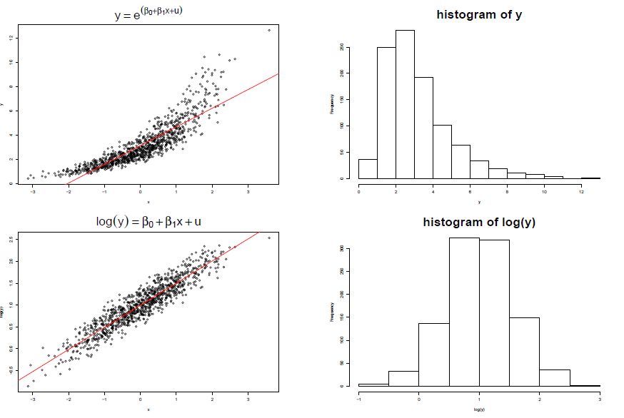
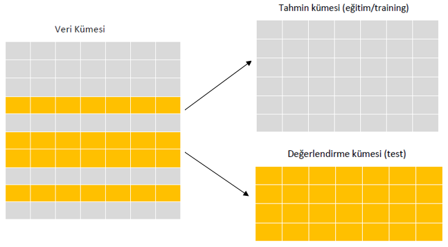
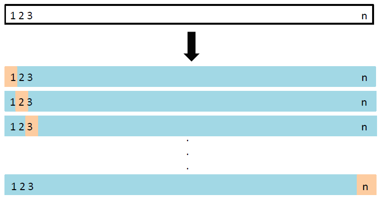

# Regresyon Analizi: Kesit Veri {#Kesit}

Bu kısımda ekonometrik analizin temelini oluşturan regresyon analizine giriş yapılacaktır. Bu kısımda yararlanılan başlıca kaynaklar: 

- Wooldridge, J. (2019), Introductory Econometrics, 7th ed, Cengage Learning.
  - R uygulamaları: 
  Heiss, F. (2016), Using R for Introductory Econometrics, CreateSpace Independent
Publishing Platform. URL: [http://www.urfie.net/](http://www.urfie.net/)

- Stock, J. and Watson, M. (2015), Introduction to Econometrics, Third Update, Global
Edition, Pearson Education Limited.
  - R uygulamaları: [https://www.econometrics-with-r.org/index.html](https://www.econometrics-with-r.org/index.html)
  
- Kleiber, C. and Zeileis, A. (2008), Applied Econometrics with R, Springer.
  - URL: [https://www.zeileis.org/teaching/AER/](https://www.zeileis.org/teaching/AER/) 
  

<!-- - @wooldridge2016 -->
<!--   - R uygulamaları: @heiss2016  -->

<!-- - @stock2015 -->
<!--   - R uygulamaları: [https://www.econometrics-with-r.org/index.html](https://www.econometrics-with-r.org/index.html) -->

<!-- - @kleiber2008  -->


## Ekonometriye Giriş 

- Ekonometri kelime anlamıyla ekonomik ölçme demektir. Ancak, ekonometrinin ugraşı alanı çok daha geniştir.

> “Ekonometri, ekonomik olayların ekonomik teori, matematik ve istatistiksel çıkarım (inference) araçlarıyla analiz edildiği bir sosyal bilimdir.” (Goldberger, A.S., 1964).

**Ekonometrinin uğraşı alanları** 

- Ekonomik ilişkilerin tahmini için istatistiksel yöntemler geliştirmek,

- Ekonomik teori ve hipotezleri test etmek,

- Ekonomi politikalarını değerlendirmek ve uygulamak,

- Tahmin-Öngörü- (forecasting) yapmak,

- Deneysel-olmayan (nonexperimental) ya da gözlemsel (observational) veri (data) toplamak ve analiz etmek.

## Veri Türleri

- **Kesitler-arası veri (cross-sectional data)**: Kişiler, tüketiciler, hane halkları, firmalar, bölgeler, ülkeler gibi mikro birimlere ait zamanın belli bir noktasında gözlemlenen verileri kapsar.

- **Zaman serisi verileri (time series data)**: Birbirine eşit zaman aralıklarında (günlük, aylık, haftalık, yıllık vb.) gözlemlenen verileri kapsar. GDP, enflasyon oranı, faiz haddi, borsa indeksi gibi birçok makroekonomik ve finansal değişkenler bu gruba girer.

- **Birleştirilmiş Kesitler-arası veri (pooled cross-section)**: Farklı zamanlarda gözlemlenerek birleştirilmiş kesitler-arası verileri kapsar. Örneğin hanehalkı işgücü anketleri

- **Panel Veri (panel data, longitudinal data)**: Farklı zamanlarda aynı mikro birimlerin gözlemlenmesiyle oluşturulmuş verileri kapsar.


## Basit Regresyon Modeli 

- Tek açıklayıcı değişkenli (basit) regresyon modeli 
$$y = \beta_0 + \beta_1 x + u$$
olarak yazılabilir. Burada 

- $y$: bağımlı değişken

- $x$: açıklayıcı değişken

- $u$: rassal (tesadüfi) hata terimidir. 

- Rassal Hata Terimi: $u$ (Error term - Disturbance term), Bağımlı değişken $y$ üzerinde etkili olan $x$'in dışındaki diğer faktörleri (modelde yer almayan olası tüm değişkenler) temsil eder.

- Bu diğer etkenlere gözlenemeyen (unobserved) faktörler denir.

- Eğer $u$'da yer alan diğer faktörler sabit tutulursa, yani $\Delta u = 0$ kabul edilirse $x$'in $y$ üzerindeki etkisi aşağıdaki gibi bulunabilir:
$$ \Delta y = \beta_1 \Delta x$$

- Eğim katsayısı $\beta_1$: Diğer faktörler sabitken (ceteris paribus) $x$'deki bir birim değişmenin $y$'de yaratacağı değişimi gösterir. 

- Sabit terim (intercept) $\beta_0$: $x=0$ iken $y$'nin alacağı değeri gösterir.

- Örnek: Eğitim düzeyi ve saatlik ücretler 

$$ ücret = \beta_0 + \beta_1 eğitim + u$$
ücret: saat başına ücretler (dolar); eğitim: eğitim düzeyi (yıl)

- Eğim Katsayısı $\beta_1$'in yorumu
$$\Delta ücret = \beta_1 \Delta eğitim$$
Ceteris Paribus eğitim düzeyindeki 1 yıllık değişim, saat başına ücretleri ortalamada $\beta_1$ \$ kadar değiştirir. 

- Rassal hata terimi $u$: Ücretleri etkileyen eğitim dışındaki diğer tüm gözlenemeyen faktörleri temsil eder. Emek piyasasındaki tecrübe (yıl), doğuştan gelen yetenek, şu an çalışılan yerdeki kıdem, iş etiği, alınan eğitimin kalitesi, çalışanın cinsiyeti, etnik kökeni, kır ya da kente yaşaması, medeni hali, çocuk sayısı, dış görünüşü vs. gibi çok sayıda faktör ücretleri etkileyebilir. 


```{r, echo=FALSE, out.width = "80%", fig.align='center'}
knitr::include_graphics("img/educ-wage-plot1.png")
``` 

## Popülasyon Regresyon Fonksiyonu 


- Basit regresyon modelinde $y$'nin $x$'e göre koşullu beklenen değerini alalım:
$$\begin{aligned}E(y|x)  & = \beta_0 + \beta_1 x + \underbrace{E(u|x)}_{=0} \\              & =  \beta_0 + \beta_1 x \end{aligned}$$

- Buna PRF adı verilir. Açıktır ki, bağımlı değişkenin koşullu beklenen değeri $x$'in doğrusal bir fonksiyonudur.

- PRF'nin doğrusallığı: $x$'deki 1 birimlik değişime karşılık $y$'nin koşullu beklenen değeri (koşullu ortalaması) $\beta_1$ kadar değişmektedir.

- Verilmiş bir $x$ düzeyinde $y$'nin dağılımının merkezi $E(y|x)$'dir. 


## (Sıradan) En Küçük Kareler (EKK) Yöntemi ile Tahmin 


- Bilinmeyen popülasyon parametreleri ( $\beta_0,\beta_1$ ) verilerden hareketle nasıl tahmin edilebilir?

- Popülasyondan $n$ gözlemli (hacimli) bir rassal örneklem (random sample) çektiğimizi düşünelim:
$$\{y_i,x_i:i=1,2,\ldots,n\}$$

- Regresyon modelini herbir gözlem için aşağıdaki gibi yazabiliriz:
$$y_i = \beta_0 + \beta_1 x_i + u_i,~~~i=1,2,\ldots,n$$

- Bu durumda elimizde iki bilinmeyenli $n$ denklem olacaktır.

- Gözlemlerle endekslenmiş model:

$$y_i = \beta_0 + \beta_1 x_i + u_i,~~~i=1,2,\ldots,n$$

- İki bilinmeyenli $n$ denklem:
$$\begin{eqnarray*}y_1 &=& \beta_0 + \beta_1 x_1 + u_1 \\
    y_2 &=& \beta_0 + \beta_1 x_2 + u_2 \\
    y_3 &=& \beta_0 + \beta_1 x_3 + u_3 \\
    \vdots &=& \vdots \\
    y_n &=& \beta_0 + \beta_1 x_n + u_n
  \end{eqnarray*}$$

- $y$'nin modelce tahmin edilen değerleri (fitted values):
$$\hat{y}_i = \hat{\beta}_0 + \hat{\beta}_1 x_i$$

- Kalıntı (residual) terimleri gözlenen ile tahmin edilen $y$ değerleri arasındaki farktır:
$$\begin{eqnarray*}\hat{u}_i &=& y_i - \hat{y}_i \\
     &=& y_i -  \hat{\beta}_0 - \hat{\beta}_1 x_i
 \end{eqnarray*}$$
 
- Kalıntı terimi, hata terimi ile karıştırılmamalıdır. $u$ gözlenemeyen bir rassal değişkendir. $\hat{u}$ ise modelce tahmin edilen bir büyüklüktür.

- **OLS-SEKK amaç fonksiyonu**: OLS (OLS = Ordinary Least Squares) yöntemi kalıntı kareleri toplamını en küçük yapacak şekilde tahmincileri seçer:
$$\min_{\hat{\beta}_0, \hat{\beta}_1} SSR = \sum_{i=1}^n \hat{u}_i^2=\sum_{i=1}^n(y_i -  \hat{\beta}_0 - \hat{\beta}_1 x_i)^2$$

- OLS yöntemi kalıntı kareleri toplamını (SSR) en küçük yapacak şekilde tahmincileri seçer:
$$\min_{\hat{\beta}_0, \hat{\beta}_1} SSR = \sum_{i=1}^n (y_i -  \hat{\beta}_0 - \hat{\beta}_1 x_i)^2$$ 

- OLS birinci sıra koşulları
$$\begin{eqnarray*}
  \frac{\partial SSR}{\partial \hat{\beta}_0 } &=& -2 \sum_{i=1}^n (y_i - \hat{\beta}_0 - \hat{\beta}_1 x_i) = 0  \\
  \frac{\partial SSR}{\partial \hat{\beta}_1 } &=& -2 \sum_{i=1}^n x_i(y_i - \hat{\beta}_0 - \hat{\beta}_1 x_i) = 0
\end{eqnarray*}$$

- Birinci sıra koşullarından elde edilen iki bilinmeyenli iki denklemli sistem belirli şartlar altında çözülebilir. 

## Popülasyon ve Örneklem Regresyon Fonksiyonları

- Popülasyon Regresyon Fonksiyonu - PRF (pratikte bilinmez)
$$E(y|x) = \beta_0 + \beta_1 x$$

- Örneklem Regresyon Fonksiyonu (Sample Regression Function - SRF)
$$\hat{y} = \hat{\beta}_0 + \hat{\beta}_1 x$$
SRF, PRF'nin bir tahmini olarak düşünülebilir. SRF verilere bağlı olarak değişir. 

- Eğim katsayısının yorumu:
$$\hat{\beta}_1 = \frac{\Delta \hat{y}}{\Delta x}$$
ya da
$$\Delta \hat{y} = \hat{\beta}_1 \Delta x$$


## Fonksiyon kalıpları 

### Regresyon modelinin doğrusallığı

$$y = \beta_0 + \beta_1 x + u$$

- $y$: bağımlı değişken, - $x$: açıklayıcı değişken

- Doğrusallık varsayımı bazı durumlarda kısıtlayıcı olabilir. 

- Değişkenlerin uygun dönüştürmelerini kullanarak bu doğrusal olmayan ilişkileri yakalayabiliriz. 

- Bu durumda model hala parametrelerde doğrusal olacaktır. 

- En yaygın kullanılan dönüştürmeler (doğal) logaritma dönüştürmesi, karesel veya kübik terimler (genel olarak polinomlar), ters kalıp, vb.
    
    

### Doğrusal olmama
 
```{r, echo=FALSE, out.width = "100%", fig.align='center'}
knitr::include_graphics("img/fkaliplar.png")
``` 
   
- Kırmızı çizgi: tahmin edilen regresyon doğrusu. 

- Hangi modeller uygun? 


### Log-level 
 
```{r, echo=FALSE, out.width = "100%", fig.align='center'}

```
 
- Orijinal model: $y = \exp(\beta_0 + \beta_1 x + u)$

- Doğal logaritma dönüştürmesi: $\log y = \beta_0 + \beta_1 x + u$

- $\beta_1$'in yorumu: $x$ değişkenindeki 1 birim değişime karşılık $y$'de tahmin edilen değişim $\%(100\beta_1)$'dir. Not: $100\Delta\log y = \%\Delta y$ 


### Level-log 

```{r, echo=FALSE, out.width = "100%", fig.align='center'}
knitr::include_graphics("img/levellog.png")
```
 
- Dönüştürülmüş model: $y = \beta_0 + \beta_1 \log x + u$

- $\beta_1$'in yorumu: $x$'deki %1 değişime karşılık $y$'de tahmin edilen değişim $(\beta_1/100)$ birimdir ( $y$'nin ölçü birimi cinsinden). 

 
### Log-log (Sabit esneklik modeli)

 
```{r, echo=FALSE, out.width = "90%", fig.align='center'}
knitr::include_graphics("img/loglog.png")
```  

- Dönüştürülmüş model: $\log y = \beta_0 + \beta_1 \log x + u$

- $\beta_1$'in yorumu: $x$'deki %1 değişime karşılık $y$'de tahmin edilen değişim % $\beta_1$ kadardır. 

- $\beta_1$ = $y$'nin $x$'e göre esnekliği.  


## Çoklu Regresyon Modeli 

- Basit regresyon modelinde sadece bir $x$ değişkeni vardır. Bu çoğu durumda gerçekçi değildir. $y$'yi etkileyen çok sayıda önemli faktör vardır. 

- Modele teorik açıdan önemli değişkenler ekleyerek $y$'deki değişkenliğin çok daha fazlasını açıklayabiliriz. 

- Ayrıca daha esnek fonksiyon kalıplarını kullanabiliriz. 

- En genel haliyle çoklu regresyon modeli aşağıdaki gibi yazılabilir. 
$$ y= \beta_0 + \beta_1 x_1 + \beta_2 x_2 + \ldots + \beta_k x_k + u$$
Modelde $k$ $x$ değişkeni ve bir sabit terim (kesme terimi) mevcuttur. Bilinmeyen parametre sayısı $k+1$'dir. 


- $\beta_j$ parametresi diğer $x$'ler ve $u$'da içerilen faktörler sabitken ( $\Delta u=0$ ), $x_j$'deki bir birimlik değişmenin $y$'de yaratacağı değişmeyi gösterir.

- Ancak $x$'ler arasında doğrusal olmayan özellik varsa bu yorum değişir.


- Örneklem Regresyon Fonksiyonu (SRF): 
$$\hat{y} = \hat{\beta}_0 + \hat{\beta}_1 x_1 + \hat{\beta}_2 x_2 + \ldots + \hat{\beta}_k x_k$$

- Sıradan En Küçük Kareler (Ordinary Least Squares - OLS) tahmin edicileri kalıntı kareleri toplamını (SSR) en küçük yapar:
$$\sum_{i=1}^n \hat{u}_i^2 = \sum_{i=1}^n (y_i - \hat{\beta}_0 - \hat{\beta}_1 x_{i1} - \hat{\beta}_2 x_{i2} - \ldots - \hat{\beta}_k x_{ik})^2$$
- Birinci sıra koşullarından elde edilen $k+1$ denklemin çözümünden OLS tahmin edicileri $\hat{\beta}_j$'ler bulunur.

- R programındaki `lm()` fonksiyonu ile model kolayca tahmin edilebilir. 


## R `lm()` Fonksiyonu 

- Syntax:

```{r, echo=TRUE, eval=FALSE}
lm(formula = y ~ x1 + x2 + ... + xk, data = veri_ismi)
```

- Burada `veri_ismi` değişkenlerin yer aldığı veri çerçevesinin ismidir. 

```{r}
library(wooldridge) # veri paketi 
# veri seti = wage1
reg1 <- lm(wage ~ educ, data = wage1)
reg1
```

- Modele sabit terim otomatik olarak eklenir. Eğer modelden sabiti çıkarmak istersek:  
```{r, echo=TRUE, eval=FALSE}
lm(y ~ 0 + x1 + x2 + ... + xk, data = df_ismi)
```

- Çok değişkenli log-level ücret regresyonu: 

```{r}
reg2 <- lm(log(wage) ~ educ + exper + tenure, data = wage1)
summary(reg2)
```

```{r}
# reg2 (liste) nesnesi regresyon sonuçlarına ilişkin bilgileri içerir
# summary() fonksiyonu ile özet bilgilere ulaşılabilir
summary(reg2)$coefficients
```

- Veri setinin bir alt kümesi için regresyonun çözümü

```{r}
# Kadın çalışanlar için ücret denklemi tahmini 
reg_K <- lm(log(wage) ~ educ + exper + tenure, 
           data = wage1, 
           subset = (female==1) # female=1 kadın, female=0 erkek
           )
summary(reg_K)
```


```{r}
# Erkek çalışanlar için ücret denklemi tahmini 
reg_E <- lm(log(wage) ~ educ + exper + tenure, 
           data = wage1, 
           subset = (female==0) # female=1 kadın, female=0 erkek
           )
summary(reg_E)
```

- Sonuçları özetleme ve tablo oluşturma: stargazer paketi

```{r message=FALSE, warning=FALSE}
# Örnek 
library(stargazer)
stargazer(list(reg2, reg_K, reg_E), type="text",keep.stat=c("n","rsq"))
```

- Sonuçları özetleme ve tablo oluşturma: `modelsummary` paketi

```{r}
library(modelsummary)
models <- list("Tüm Örneklem" = reg2, 
               "Kadınlar" = reg_K, 
               "Erkekler"=reg_E)
modelsummary(models)
```


- Robust standart hatalar: 

```{r}
# vcov = c("classical", "robust", "bootstrap", "stata", "HC4") 
# detaylar için bkz sandwich paketi
modelsummary(models, vcov = "robust")
```


```{r}
# istatistiksel anlamlılık için yıldız ekleme
modelsummary(models, vcov = "robust", stars = TRUE)
```


Kullanım klavuzu ve detaylı örnekler için bkz. [https://vincentarelbundock.github.io/modelsummary/articles/modelsummary.html](https://vincentarelbundock.github.io/modelsummary/articles/modelsummary.html)


## Kukla (kategorik) değişkenler 


* Regresyon modellerinde niteliksel bilgiyi içeren kategorik değişkenleri ekleyebiliriz. 

* İki kategori, cinsiyet = Kadın, Erkek
$$x_{i}=\left\{\begin{array}{ll}
1, & \text { eğer } i . \text { kişi kadın ise } \\
0, & \text { eğer } i . \text { kişi erkek ise. }
\end{array}\right.$$

$$y_{i}=\beta_{0}+\beta_{1} x_{i}+\epsilon_{i}=\left\{\begin{array}{ll}
\beta_{0}+\beta_{1}+\epsilon_{i}, & \text { eğer } i . \text { kişi kadın ise } \\
\beta_{0}+\epsilon_{i}, & \text { eğer } i . \text { kişi erkek ise. }
\end{array}\right.$$


* $\beta_0$: erkek grubu için regresyon kesme noktası (sabit)
* $\beta_{0}+\beta_{1}$: kadın grubu için kesme noktası
* İki kategori için bir kukla değişken eklemek yeterli. 
* İkiden fazla kategorisi olan değişkenler için bir eksiği kadar kukla değişken modele eklenebilir. Örneğin etnik köken değişkeni 3 gruba sahipse, modele 2 kategoriyi temsil eden kukla değişkenin eklenmesi yeterlidir. Dışlanan grup kesme terimi ile temsil edilir (baz grup). 

```{r, echo=FALSE, out.width = "100%", fig.align='center'}
knitr::include_graphics("img/ucret_cins1.png")
``` 

* Ücretlerin cinsiyet (female = 1 kadın ise, female = 0 erkek ise) kuklası üzerine regresyonu

```{r}
res1 <- lm(wage ~ female, data = wage1)
summary(res1)
```


$$\widehat{wage} = 7.1 - 2.51 female$$
Baz grup (0 grubu) erkek çalışanlardır. Buna göre erkek çalışanların sabit terimi 7.1'dir. Kadın çalışanların (female=1) sabit terimi erkeklerden 2.51 USD daha düşüktür (4.5$)

* Modelde başka bir x değişkeni olmadığı için 7.1 erkek grubundaki aritmetik ortalamadır. Kadın grubundaki aritmetik ortalama ise 4.5$'dır. 

```{r, echo=FALSE, out.width = "100%", fig.align='center'}
knitr::include_graphics("img/ucret_cins2.png")
``` 

* Tahmin sonuçları 


```{r}
res2 <- lm(log(wage) ~ female + educ, data = wage1)
summary(res2)
```


$$\widehat{\log wage} = 0.83  - 0.36 female + 0.077educ$$
Baz grup (0 grubu) erkek çalışanlardır. Buna göre erkek çalışanların sabit terimi 0.83'dir. Kadın çalışanların (female=1) sabit terimi erkeklerden 0.36 daha düşüktür (0.47). 

* Educ değişkeninin katsayısı 0.077 her iki grup için de aynıdır. Yani bir yıllık fazladan eğitimin getirisi hem kadınlar için hem de erkekler için % 7.7'dir. 

* Eğitim düzeyi aynı olan bir erkek ve kadını karşılaştırdığımızda kadınlar hala daha az kazanıyor. 


## Etkileşim değişkenleri 

* Bazı durumlarda bir değişkenin marjinal etkisi başka bir değişkene bağlı olabilir. 

* Örneğin satış ve reklam harcamaları modelinde radyo ilan harcamaları TV reklamlarının etkisi arttırabilir. 
$$sales = \beta_{0}+\beta_{1}~ TV+\beta_{2}~ Radio + \beta_3~ (TV\times Radio) + \epsilon$$
ya da 
$$sales = \beta_{0}+(\beta_{1}+\beta_3 Radio)~ TV+\beta_{2}~ Radio  + \epsilon$$
Böylece 
$$\frac{\Delta Sales}{\Delta TV}=\beta_{1}+\beta_3 Radio,\quad \frac{\Delta Sales}{\Delta Radio}=\beta_{2}+\beta_3 TV$$
 

- Örnek ^[Bu örnek için bkz. James et al. (2021, s.89) An Introduction to Statistical Learning with Applications in R, [https://www.statlearning.com/](https://www.statlearning.com/)]

|              | Estimate| Std. Error| t value| Pr(>&#124;t&#124;)|
|:-------------|--------:|----------:|-------:|------------------:|
|(Intercept)   |   6.7502|     0.2479| 27.2328|             0.0000|
|TV            |   0.0191|     0.0015| 12.6990|             0.0000|
|radio         |   0.0289|     0.0089|  3.2408|             0.0014|
|I(TV * radio) |   0.0011|     0.0001| 20.7266|             0.0000|

* TV, radio: USD cinsinden televizyon ve radyo reklam harcamaları,
* Radyo reklamlarındaki 1000 dolarlık bir artış için satışlarda ortalamada ne kadar değişim tahmin edilmiştir? 
* $\Delta Sales = (0.0289+0.0011TV)\times 1000 = 28.9 + 1.1TV$
* Ortalama TV harcamaları 147. Bunu TV yerine yazarsak ortalamadaki etkiyi 190.6 USD olarak buluruz.

- Örnek: Eğitimin getirisi kadın ve erkeklerde farklı mı? 

```{r}
res3 <- lm(log(wage) ~ educ + exper + tenure + female + I(female*educ), 
           data = wage1)
summary(res3)
```

- Başka bir yol
```{r}
res4 <- lm(log(wage) ~ educ*female + exper + tenure, data = wage1)
summary(res4)
```

## Karesel ve polinom terimler

* Modelin parametrelerde doğrusal olan yapısını bozmadan $y$ ve $x$ değişkenlerinin uygun dönüştürmelerini kullanarak doğrusal olmayan ilişkileri yakalayabiliriz. 

* Pratikte en çok kullanılan dönüştürmeler (doğal) logaritma ve üstel dönüştürmelerdir. Bu modellerin özelliklerini daha önce incelemiştik. 

* Polinom regresyonu: $X$ değişkeninin $X^2$ ve $X^3$ gibi dönüştürmelerini modele ekleyebiliriz. Örneğin karesel model: 
$$Y = \beta_0 + \beta_1 X + \beta_2 X^2 + \epsilon$$
Bu model aslında $X$ değişkeninin kendisiyle etkileşim içinde olduğu anlamına gelir. $X$'in $Y$ üzerindeki etkisi $X$'in değerine bağlıdır. 


- Örnek: ücret denkleminde tecrübe ve tenure karesini ekleme:


```{r}
res5 <- lm(log(wage) ~ educ + exper + tenure + female + 
             I(female*educ) + I(exper^2) + I(tenure^2), 
           data = wage1)
summary(res5)
```

- veri setinde ortalama eğitim düzeyi 12.5 yıldır. Etkileşim terimlerini eğitimin ortalamadan farkı ile de kurabiliriz: 
```{r}
summary(lm(log(wage) ~ female + I(educ-12.5) + I(female*(educ-12.5)) +
             exper+I(exper^2) + tenure+I(tenure^2), data=wage1))
```


## Hipotez testleri 

* Her zaman PRF ile ilgili: $Y=\beta_0 + \beta_1 X + u$ 

* Boş hipotez: $X$ ile $Y$ arasında bir ilişki yoktur. 
$$H_0: \beta_1 = 0$$ 

* Alternatif hipotez: $X$ ile $Y$ arasında bir ilişki vardır.  
$$H_a: \beta_1 \neq 0$$


* $H_0$ $t$ testi ile sınanabilir. Boş hipotez altında $t$ test istatistiği: 
$$t = \frac{\hat{\beta}_1-0}{\operatorname{se}\left(\hat{\beta}_{1}\right)}=\frac{\hat{\beta}_1}{\operatorname{se}\left(\hat{\beta}_{1}\right)}$$

* $X$ ile $Y$ arasında hiç bir ilişki yoksa (yani boş hipotez doğruysa) $t$ istatistiği $n-2$ serbestlik derecesiyle $t$ dağılımına uyar.

### t-testi karar kuralı

* Basit regresyon modelinde boş hipotez $H_0: \beta_1 = 0$ ve alternatif $H_a: \beta_1 \neq 0$ için t testi karar kuralı: 

> Verilmiş bir Tip-I hata olasılığı, $\alpha = Pr(|T|>c_{\alpha/2}~|~H_0)$, için hesaplanan $t$ istatistiğinin mutlak değeri kritik değer $c_{\alpha/2}$'den büyükse boş hipotez reddedilebilir. $$t>c_{\alpha/2}~~ \mbox{ya da}~~ t<-c_{\alpha/2}~~\mbox{ise}~~H_0~~red$$

(Not: Burada $T$, $n-2$ serbestlik derecesine sahip bir $t$ rassal değişkenidir.)

* Bir boş hipotezin doğru olup olmadığı pratikte hiç bir zaman bilinemez. İki tip hata yapılabilir. Bunların olasılıkları: 

  * Tip-I hata olasılığı: $Pr(H_0~~ RED~|~H_0~DOĞRU)$.

  * Tip-II hata olasılığı: $Pr(H_0~~ KABUL~|~H_0~YANLIŞ)$. Bu olasılığı pratikte belirleyemeyiz.
 
### p-değeri 

* Her seferinde tablo kritik değerlerine bakmak yerine $\alpha$'yı elimizdeki örneklemden hareketle tahmin etmeye çalışabiliriz. 

* $p$-değeri: Elimizdeki örneklemden hareketle aynı testi yapsak boş hipotezi kabul etmemizle sonuçlanacak en büyük anlamlılık düzeyi, $\alpha$, kaçtır? 

* Örnek: $n-2=65$, hesaplanan $t$ istatistiği $t=1.82$ olsun. 
$$p-değeri=Pr(T>1.82|H_0) + Pr(T<-1.82|H_0) = 0.0367 + 0.0367 = 0.0734$$
```{r}
2*pt(1.82, df=65, lower.tail = FALSE)
```

* $H_0$'ın reddi için en düşük anlamlılık düzeyi=%7.34. Bundan daha yüksek tüm $\alpha$ düzeylerinde $H_0$ RED. Örneğin, testi $\alpha=0.05$ düzeyinde yaparsak boş hipotez reddedilemez. $p$-değeri ne kadar küçükse elimizdeki örneklemde boş hipotez aleyhine kanıt o kadar güçlü demektir.

### t-testi: Örnek 

```{r}
library(wooldridge)
model1 <- lm(wage ~ educ, data = wage1)
broom::tidy(model1)
```
Denklem formunda yazarsak:
$$\widehat{wage} = -0.905 + 0.54~ educ,~~~R^2 = 0.165$$
Standart hatalar: $se(\hat{\beta}_0)=0.685$, $se(\hat{\beta}_1)=0.0533$. 

- Eğim parametresinin anlamlılığına ilişkin t testi:  
$$t_{\beta_1} = \frac{0.54136}{0.05325} = 10.167 \sim~t(524)$$
- Karar: $H_0:\beta_1=0$ boş hipotezi alternatif hipotez lehine reddedilir. Hesaplanan t istatistiği $\alpha=0.05$ anlamlılık düzeyindeki kritik değerden daha büyüktür: $|t_{\beta_1}|>1.96$. 

- Eğitim düzeyi ücretler üzerinde istatistik bakımından anlamlı bir etkiye sahiptir. 
- p değeri $\alpha=0.05$ düzeyinden küçüktür (H0 red).  

###  F Testi: Çoklu Doğrusal Kısıtların Testi

- Regresyondaki $t$ istatistikleri anakütleye ait beta parametrelerinin belli bir sabite eşit olup olmadığını test etmemize yarar.

- Parametrelerin tek bir doğrusal kombinasyonunun (kısıtın) belli bir sabite eşit olup olmadığının testini ise, önceki örnekte gördüğümüz gibi, değişkenleri dönüştürerek modeli yeniden düzenlemek suretiyle yapıyorduk.

- Ancak, şu ana kadar hep tek bir kısıtlamaya ilişkin test yapıyorduk.

- Şimdi çok sayıda kısıt varken nasıl test yapacağımızı görelim. 

### Dışlama kısıtları 

- Regresyonda yer alan bir değişkenler grubunun birlikte $y$ üzerinde anlamlı bir etkisinin olup olmadığını test etmek istiyoruz.

- Örneğin şu modelde
$$y = \beta_0 + \beta_1 x_1 + \beta_2 x_2 +\beta_3 x_3 +\beta_4 x_4 +\beta_5 x_5 + u$$
şu hipotezi test etmek istiyoruz:
$$H_0: \beta_3 =0, \beta_4=0, \beta_5=0$$
$$H_1: \beta_3 \neq 0, \beta_4\neq 0, \beta_5\neq 0$$
- Boş hipotez, $x_3$, $x_4$ ve $x_5$ değişkenlerinin birlikte $y$ üzerinde bir etkisinin olmadığını söylemektedir. Alternatif hipotez en az birinin sıfırdan farklı olduğunu söylemektedir.


- Kısıtlanmamış (UnRestricted) Model
$$y = \beta_0 + \beta_1 x_1 + \beta_2 x_2 +\beta_3 x_3 +\beta_4 x_4 +\beta_5 x_5 + u$$
$SSR_{ur},~~~R^2_{ur}$

- Kısıtlanmış (Restricted) Model
$$y = \beta_0 + \beta_1 x_1 + \beta_2 x_2 + u$$
$SSR_{r},~~~R^2_{r}$

- $H_0$ doğru kabul edildiğinde kısıtlanmış modele ulaşılır.

- Her iki model ayrı ayrı tahmin edilerek kalıntı kareleri toplamlarındaki değişim $F$ testi yardımıyla karşılaştırılabilir. 

- F test istatistiği
$$F = \frac{(SSR_r - SSR_{ur})/q}{SSR_{ur}/(n-k-1)}\sim~~F_{q,n-k-1}$$

- $SSR_r$ kısıtlanmış modelin, $SSR_{ur}$ ise kısıtlanmamış modelin Kalıntı Kareleri Toplamıdır.

- $q=df_r-df_{ur}$: toplam kısıt sayısı, payın serbestlik derecesi (kısıtlanmamış modelin parametre sayısından kısıtlanmış modelin parametre sayısı çıkarılarak bulunabilir)

- Paydanın serbestlik derecesi ( $df_{ur}$ ) kısıtlanmamış modelin serbestlik derecesine eşittir.

- Karar kuralı: $F>c$ ise $H_0$ RED. $c$, ilgili $F_{k,n-k-1}$ dağılımında %100$\alpha$ düzeyindeki kritik değerdir.


### F testi için karar kuralı 


- F testi her zaman sağ kuyrukta yapılır. 

- Hesaplanan F değeri verilmiş bir anlamlılık düzeyindeki (alfa) kritik değerden daha büyükse H0 reddedilir.

- Ya da F testinin p-değeri yeterince küçükse (örneğin alfa = 0.05'den küçükse) boş hipotez reddedilir.  

### Doğrusal kısıtlar: örnek

- Aşağıdaki ev değeri modelini düşünelim: 
$$\log(fiyat) = \beta_0+\beta_1 \log(ekspertiz)+\beta_2 odasay+\beta_3metrekare+\beta_4okul + u$$
Burada fiyat evin satış değerini, ekspertiz gayrimenkul uzmanlarınca yapılan değerlemeyi, odasay evdeki toplam oda sayısını, metrekare evin büyüklüğünü, okul ise civardaki okulların kalitesini göstermektedir. 

- İyi işleyen bir gayrimenkul piyasasında ekspertiz ile evin değeri arasında bire bir bir ilişki bekleriz (evin özelliklerini dikkate aldıktan sonra)

- Ev değerlemesi rasyonel yapıldıysa (piyasada balon yoksa) log(ekspertiz) katsayısı 1, diğer tüm katsayılar 0 olmalı: 
$$H_0: \beta_1 = 1,~ \beta_2=0,~ \beta_3 =0,~ \beta_4 = 0$$


- Kısıtlanmamış model: 
$$\log(fiyat) = \beta_0+\beta_1 \log(ekspertiz)+\beta_2 odasay+\beta_3metrekare+\beta_4okul + u$$

- Kısıtlanmış model: 
$$H_0: \beta_1 = 1,~ \beta_2=0,~ \beta_3 =0,~ \beta_4 = 0$$
altında kısıtlanmış model: 
$$\log(fiyat) = \beta_0+\log(ekspertiz) + u$$
ya da 
$$\log(fiyat) - \log(ekspertiz) = \beta_0 + u$$

### Regresyonun Bütün Olarak Anlamlılığı

- Boş hipotezimiz şudur: regresyona eklenen açıklayıcı değişkenlerin $y$ üzerinde birlikte etkisi yoktur:
$$H_0:\beta_1=\beta_2=\ldots=\beta_k=0$$

- Alternatif hipotez: en az biri sıfırdan farklı olduğunu söyler. Boş hipoteze göre kurulan modelin bir açıklayıcılığı yoktur. Bu boş hipotez altında
$$y = \beta_0 +u$$

- Bu boş hipotez $F$ testiyle sınanabilir. $F$ test istatistiği
$$F = \frac{R^2/k}{(1-R^2)/(n-k-1)}\sim~F_{k,n-k-1}$$

- Buradaki $R^2$ kısıtlanmamış modelden elde edilen determinasyon katsayısıdır. Standart ekonometri paket programları regresyonun bütün olarak anlamlılığını sınayan F istatistiğini otomatik olarak hesaplar.
    
 

## Regresyon Analizinde Potansiyel Problemler

- Hata varyansının sabit olmaması (heteroskedasticity)

- Hata teriminde otokorelasyon veya dizisel/mekansal korelasyon

- Fonksiyon biçiminin yanlış olması, doğrusal olmayan ilişkiler 

- Bağımlı değişkende çok küçük ya da büyük değerler (outliers)

- X'lerde çok büyük ya da küçük değerler (yüksek kaldıraç oranları)

- Yüksek çoklu doğrusallık (multicollinearity) 

- Potansiyel problemlerin teşhisinde kalıntıların görselleştirilmesi faydalı olabilir. Kalıntıların $\hat{y}$'ya veya $x$'lere göre serpilme çizimi önemli bilgi sunar. 

- Kalıntıların sıfır çevresinde rassal dağılmasını bekleriz. Belirgin bir örüntü genellikle probleme işaret eder. 

- **Örnek**: Simülasyonla bir veri seti türeterek regresyon modeli tahmin edelim ve tanısal grafikleri çizelim.

```{r}
set.seed(1) # aynı sonuçları elde etmek için 
n   <- 250
x1  <- rnorm(n, mean=0, sd=1) 
y   <- 1 + 2*x1 + rnorm(n, mean=0, sd=1)  # popülasyon regresyon modeli biliniyor
df1 <- tibble(id=1:n, y, x1)
reg_df1 <- lm(y ~ x1, data = df1)
```


```{r}
# diagnostic plots
par(mfrow=c(2,2))
plot(reg_df1)
```


Bu grafiklere tek tek bakalım: 
```{r}
plot(reg_df1, which = 1)
```


```{r}
# RESET spesifikasyon hatası testi
# Modellenmeyen doğrusal olmayan ilişkiler var mı? 
library(lmtest)
resettest(reg_df1) # RESET test, H0: spesifikasyon hatası yoktur
```

Bu sonuçlara göre (p-değeri=0.48) boş hipotez kabul edilir. Yukarıdaki modelde fonksiyon kalıbı doğru kurulmuştur. 


- **Residuals vs Fitted**: bu serpilme çiziminin sıfır çevresinde rassal dağılmasını bekleriz. Belirli bir örüntü varsa bu doğrusal olmayan ilişkilerin varlığına işaret edebilir. 

```{r}
plot(reg_df1, which = 2)
```


- **Normal Q-Q**: İkinci grafik normal dağılımdan sapmaları gösteren Q-Q grafiğidir. Standardize edilmiş kalıntılar eğer normal dağılırsa aşağı yukarı kesikli çizgi ile çakışmalıdır. Yukarıdaki grafikte kalıntıların normal dağıldığı görülüyor. İstenirse Jarque-Bera gibi normallik testleri ile bu grafikler desteklenebilir. 


```{r}
plot(reg_df1, which = 3)
```


- **Scale-Location**: Üçüncü grafik (alt sol) kalıntı ve fit değerlerinin scale-location grafiğini görüyoruz. Dikey eksende standardize edilmiş kalıntıların mutlak değerinin kare kökü yer alıyor. Yine bu grafikte de sıfır çevresinde rassal bir dağılım bekliyoruz. Eğer belirgin bir örüntü varsa bu kalıntıların varyansının sabit olmadığına işaret eder (heteroskedasticity). Ancak bu grafiğin yorumunu fonksiyon kalıbını doğru bir şekilde seçtiğimizden emin olarak yapmalıyız. Ayrıca Breusch-Pagan, White gibi değişen varyans testleri de yapılmalıdır. 

```{r}
# Breusch-Pagan değişen varyans testi
library(lmtest)
bptest(reg_df1) # BP test, H0: sabit varyans
```
BP test istatistiği oldukça küçüktür. P değeri 0.9 olarak bulunmuştur. Varyansın sabit olduğunu söyleyen boş hipotez reddedilemez. Modelde değişen varyans yoktur. 


```{r}
plot(reg_df1, which = 5)
```

- **Residual vs Leverage**: Dördüncü (alt sağ) grafik yüksek etkili gözlemlerin (influential observations - high leverage) saptanmasında kullanılabilir. Bu gözlemler regresyonu önemli ölçüde etkileyen uç değerlerdir. Grafikte kırmızı kesikli çizgi ile Cook’s D (distance) değerleri gösterilmiştir. Bu kırmızı kesikli çizginin dışına düşen değerler yüksek etkili gözlemler olarak düşünülebilir. Cook’s D istatistiği Grafiğe göre yüksek etkili gözlem yoktur.  

Cook's D değerlerinin grafiği: 
```{r}
plot(reg_df1, which = 4)
```


Ortalama Cook's D ve Ortalama hatvalues: 
```{r}
mean(cooks.distance(reg_df1))
mean(hatvalues(reg_df1))
```

Cook's D Cut-off değeri 
```{r}
cutoff <- 3*mean(cooks.distance(reg_df1))
```

```{r}
plot(reg_df1, which = 4)
abline(h=cutoff,lty=2)
```


## Kestirim (Prediction)


- Regresyon analizinin temel amaçlarından biri kestirim (prediction) veya öngörü (forecasting) yapabilmektedir. 

- Kestirim: yatay-kesit verilerle bağımlı değişkenin tahmin edilmesi

- Öngörü: zaman serisi verileriyle gelecek değerlerin kestirilmesi/tahmin edilmesi

- Regresyon modelini OLS yöntemiyle çözdükten sonra verilmiş x değerlerini modelde yerine yazarak kestirim değerini oluşturabiliriz. 

- Örneğin 
$$\hat{y} = \hat{\beta}_0 + \hat{\beta}_1 x_1 + \hat{\beta}_2 x_2 +\ldots+ \hat{\beta}_k x_k$$
modelinde kestirim değerleri $x_1=c_1$, $x_2=c_2,\ldots,x_k=c_k$ olsun. 

Bilinmeyen kestirim değerine $\theta_0$ diyelim:
$$\theta_0 = \beta_0 + \beta_1c_1+\beta_2c_2+\ldots+\beta_k c_k$$

- OLS tahmincisi: 
$$\hat{\theta}_0 = \hat{\beta}_0 + \hat{\beta}_1 c_1 + \hat{\beta}_2 c_2 +\ldots+ \hat{\beta}_k c_k$$

- Kestirimin %95 Güven Aralığı:
$$\hat{\theta}_0 \pm~2~se(\hat{\theta}_0)$$

- Verilerde olmayan tekil bir gözlem için oluşturulan kestirimin güven aralığı, ortalama için oluşturulan kestirimin güven aralığından daha geniştir.

- Tekil gözleme ilişkin kestirim standart hatası çok daha büyüktür. 

## Makine Öğrenmesi ve Regresyon Analizi 

- Makine öğrenmesi "bilgisayarların örnek veriler ya da geçmiş deneyimlerden hareketle kestirim başarılarını en yüksek yapacak şekilde programlanması" biçiminde tanımlanabilir (Alpaydın, Yapay Öğrenme, 2018, s.3)

- Finansal ve ekonomik verilerle kestirim/öngörü, sınıflandırma, ve kümeleme problemlerinin çözümüne yönelik algoritmaların geliştirilmesi makine öğrenmesinin konusunu oluşturur. 

- Makine öğrenmesi iki gruba ayrılabilir: 
  - Gözetimli makine öğrenmesi (supervised machine learning) ve 
  - Gözetimsiz makine öğrenmesi (unsupervised machine learning)


- Gözetimli öğrenmede girdi değişkenleri (özellikler ya da öznitelikler) ile çıktı değişkeni gözlemlenebilir. Her gözleme ait bir çıktı değeri ya da kategorisi (etiketi) mevcuttur. Amaç çıktıyı kestirmekte en başarılı modeli bulmaktır. 

* Örnek: bir kredi başvurusundan hareketle ödeyememe riskini (olasılığını) öngörmek

  + Bir banka geçmişteki kredi başvurularından hareketle bir ödeyememe modeli kurabilir. Krediye başvuran bireyin özellikleri (features) kurulan modelde değerlendirilerek bir kestirim yapılabilir (Örneklem-dışı kestirim-out-of-sample prediction).
  
* Gözetimli öğrenme türleri: regresyon problemleri, sınıflandırma problemleri.


* Gözetimsiz Öğrenmede ise girdi değişkenleri (kestirim değişkenleri ya da öznitelikler) gözlemlense de bir çıktı değişkeni ya da etiket yoktur. 

* Yaygın kullanılan problemler: kümeleme ve boyut küçültme 

* Kümeleme (clustering): bir özellik setinden hareketle homojen gruplar bulunabilir mi? Örneğin benzer özelliklere sahip tüketici grupları, hasta türleri, benzer davranışa sahip seçmen grupları vb.

* Boyut küçültme (dimensionality reduction): çok sayıda potansiyel kestirim değişkeni arasından en önemlilerinin seçilmesi

## Regresyon ve gözetimli öğrenme 
 

- Tipik bir (gözetimli) makine öğrenmesi problemini aşağıdaki gibi yazabiliriz: 
$$y = f(x_1, x_2, \ldots, x_p) + \epsilon$$
Burada $y$ çıktı değişkenini (etiketleri), $\{x_1, x_2, \ldots, x_p\}$ ise özellikleri ifade etmektedir. $\epsilon$ rassal hata terimidir. 

- Bilinmeyen fonksiyon kalıbı $f(\cdot)$ ile gösterilmiştir. 

- Kestirim Başarısının Ölçümü: Modelin kestirimini şöyle yazalım: 
$$\hat{y} = f(x_1, x_2, \ldots, x_p)$$
- Makine öğrenmesi probleminde amaç kestirim hatasını, $y-\hat{y}$, en küçük yapmaktır. 

- Tahmin doğruluğu (accuracy) tipik olarak Ortalama Hata Karesi (Mean Squared Error - MSE) ile ölçülür

- Modelin $y = f(x) + \epsilon$ olduğunu, tahminin ise $\hat{f}(x)$ ile gösterildiğini varsayalım. 

- Böyle bir regresyon problemi için Ortalama Hata Karesi (MSE) aşağıdaki gibi tanımlanabilir: 
$$MSE = \frac{1}{n}\sum_{i=1}^{n}(y_i - \hat{f}(x_i))^2$$
- Burada $n$ gözlemden oluşan bir **eğitim** (training) veri seti kullanılmıştır. 

## Test MSE 

- Tipik olarak bir gözetimli öğrenme probleminde eğitim verisinde MSE en küçük olacak şekilde tahmin yapılır. Örnek: Sıradan En Küçük Kareler tahmininde kalıntı kareleri toplamını minimum yapan katsayı tahminleri bulunur. 

- Bir makine öğrenmesi uygulamasında asıl amaç eğitim verisinde modelin performansının ne olduğu değildir. 

- Önemli olan tahminde (eğitimde) **kullanılmamış** yeni bir veri setinde nasıl performans gösterdiğidir. 

- Eğitimde kullanılmayan, sadece kestirim performansının (doğruluğunun) değerlendirilmesinde kullanılan veri setine **test** verileri denir. 

- Eğitim MSE'nin en küçük olması test MSE'nin de en küçük olacağı anlamına gelmez. 

- Modelin esnekliği arttıkça MSE(eğitim) azalır. Aşırı uyum (overfitting) tehlikesi vardır. 

- Eğitim Verileri: $\{Y_i, \mathbf{X}_i\}_{i=1}^n$

- Test Verileri: $\{Y_{0i}, \mathbf{X}_{0i}\}_{i=1}^m$


```{r, echo=FALSE, out.width = "100%", fig.align='center'}

``` 


- Test MSE: 

$$MSE_{test} = \frac{1}{m}\sum_{i=1}^{m}(y_{0i} - \hat{f}(x_{0i}))^2$$

- Modelin eğitim verilerinden hareketle tahmininden sonra test verileri ile tahmin yapılarak 
kolayca hesaplanabilir. 

## Aşırı uyum ve makine öğrenmesi

- Makine öğrenmesi yaklaşımında amaç eğitim verilerinde hatanın en küçük olması değildir. Asıl amaç yeni veri setindeki kestirim başarısıdır. (out-of-sample prediction error). 

- Ancak pratikte elimizde sadece bir veri kümesi vardır. Bu verilerden hareketle örneklem-dışı kestirim başarısını nasıl tahmin edebiliriz? 

- Bunun için elimizdeki verileri rassal olarak iki gruba ayırabiliriz: Örneğin verilerin %80'ini modelin eğitilmesinde, kalan %20'sini ise kestirim hatasının hesaplanmasında kullanabiliriz (test verileri). 

- Buna geçerleme (validation) yaklaşımı denir. Pratikte iki yaklaşım kullanılabilir: (1) Biri-hariç çapraz geçerleme, (2) k-katlı çapraz geçerleme. 

- Zaman serileri için belirli bir t zamanına kadar olan verilerle modeli tahmin edip, t+1, t+2, ...., zamanları için öngörü yapabiliriz. Zaman sırasının değişmemesi gerekir. 

## Biri Hariç Çapraz Geçerleme, LOOCV (Leave-one-out Cross Validation)

  
* Gözlemlerden sadece biri geçerlemede kullanılır; geriye kalan (n-1) gözlem modelin eğitiminde kullanılır. 
* Bu süreç her seferinde bir gözlem eğitimden dışlanacak şekilde n kere tekrarlanır ve her biri için $MSE_i$ elde edilir.
* Bu $n$ MSE değerinin ortalaması test hata tahminidir: 
$$\mathrm{CV}_{(n)}=\frac{1}{n} \sum_{i=1}^{n} \mathrm{MSE}_{i}$$ 

```{r, echo=FALSE, out.width = "100%", fig.align='center'}

```   
 
## $k$-Katlı Çapraz Geçerleme 
 
* Biri-hariç çapraz geçerleme $n$ büyük olduğunda hesaplamada zorluk çıkarabilir. 
* Alternatif olarak gözlemler rassal şekilde $k$ gruba (kat) ayrılabilir. 
* Sırasıyla her kat geçerleme seti olarak kullanılır; geriye kalan gözlemlerle model eğitilir. 
* Sonuçta elimizde $k$ tane MSE değeri vardır. Test hata tahmini bunların ortalamasıdır: 
$$\mathrm{CV}_{(k)}=\frac{1}{k} \sum_{i=1}^{k} \mathrm{MSE}_{i}$$

```{r, echo=FALSE, out.width = "100%", fig.align='center'}
knitr::include_graphics("img/cv2.PNG")
```  

